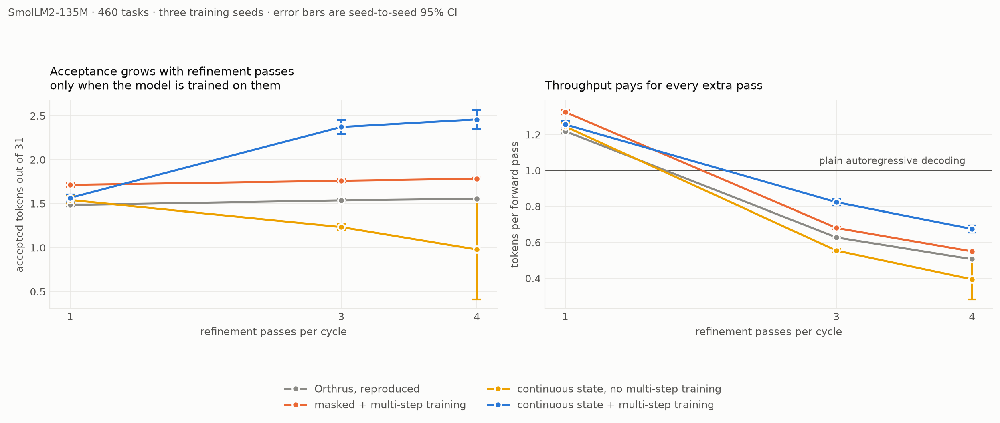
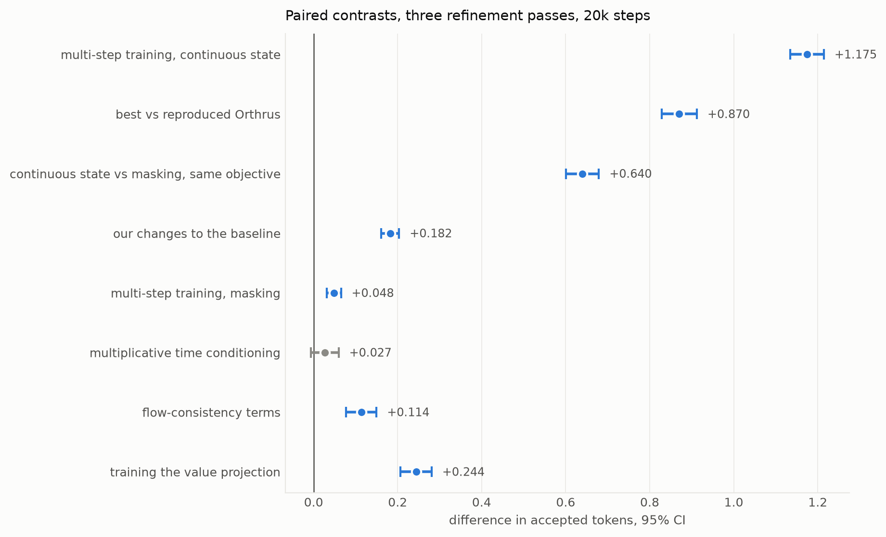
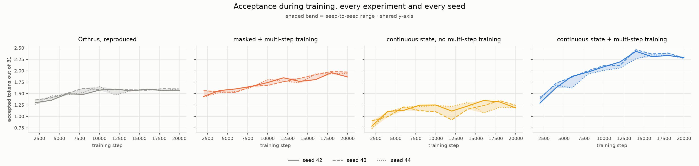
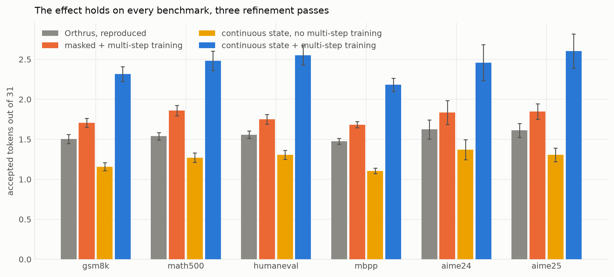
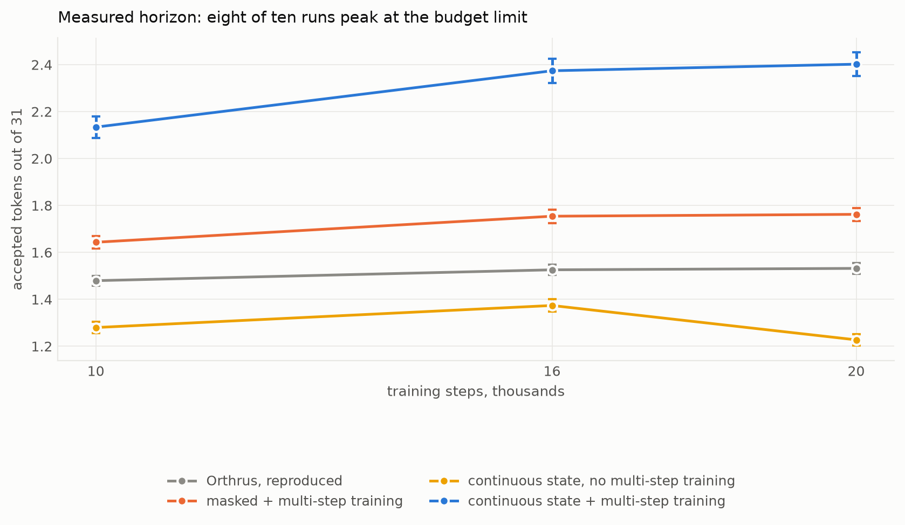
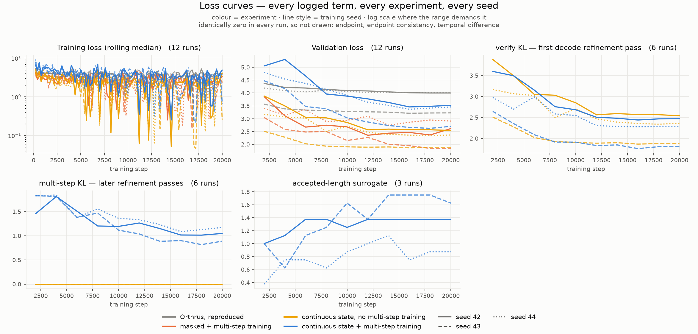
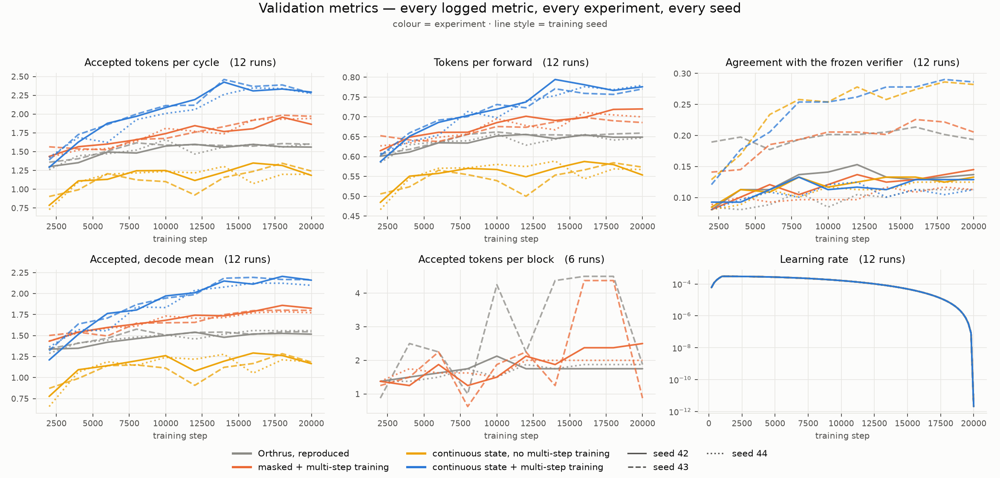

# FlowDraft: Flow-Map Drafting for Lossless Parallel Decoding

> Raising the **acceptance ceiling** of lossless parallel decoding by upgrading the *drafter* to a **Categorical Flow Map** — faster generation, provably identical output.

<!-- Badges — TODO: fill in once the repo is public


-->

> **Status: the multi-step study is complete.** Ten training runs on SmolLM2-135M at 20k steps, three replicated across three seeds, measured on 460 tasks from six benchmarks with the training seed as the unit of observation. Decoding is bitwise-lossless at greedy and, via Gumbel coupling, at sampling. Results: [EXPERIMENTS.md](EXPERIMENTS.md). **Nothing has run on CUDA or on Qwen3** — those presets are written and reviewed but never exercised on that hardware.

**Summer of Machine Learning at Skoltech (SMILES) · Applied AI Center**

---


## Table of contents

- [Multi-step drafting study (August 2026)](#multi-step-drafting-study-august-2026)
- [Overview](#overview)
- [Quickstart](#quickstart) — setup, sparse attention, training, validation, statistics, curves
- [Experiments](#experiments) — the four presets and what each one tests
- [Background: the decoding bottleneck](#background-the-decoding-bottleneck)
- [Host framework: Orthrus](#host-framework-orthrus)
- [The problem](#the-problem)
- [Key idea: a Categorical Flow Map drafter](#key-idea-a-categorical-flow-map-drafter)
- [CFM training, in brief](#cfm-training-in-brief)
- [Goals](#goals)
- [Expected deliverables](#expected-deliverables)
- [Method](#method)
- [Repository structure](#repository-structure)
- [Installation](#installation)
- [Usage](#usage)
- [Training](#training)
- [Configuration reference](#configuration-reference)
- [Inference parameters, in plain words](#inference-parameters-in-plain-words)
- [Evaluation](#evaluation)
- [Results](#results)
- [References](#references)
- [Team](#team)
- [Acknowledgments](#acknowledgments)
- [License](#license) 🚧

## Multi-step drafting study (August 2026)

Ten training runs on SmolLM2-135M at 20k steps, three of them replicated across
three seeds. Measured on 460 tasks from six benchmarks: 56,000 per-prompt
observations at one seed, plus 144 further measurements across seeds at the
common horizon. Full write-up, objective and mathematics:
[EXPERIMENTS.md](EXPERIMENTS.md).

**Headline.** Orthrus concludes that single-step projection is optimal, and
measures it in tokens per forward: its Table 3 puts a two-pass variant at 3.53
against 6.35 for one pass. **On that metric our measurements agree with the
paper, for every configuration including our own** — extra decode passes always
cost more than they return. What a continuous state changes is *acceptance*:
trained on its own refinement, it keeps gaining as passes are added (1.58 → 2.51
from one pass to four) where the masked drafter is flat (1.72 → 1.79) and an
untrained continuous state collapses (1.56 → 1.23). Separately, the multi-step
*training* term raises throughput at a single pass, by +8.8% on the masked
drafter. Intervals below use the **training seed** as the unit of observation
(three seeds, df = 2), so they describe the method rather than one trained model.

**Scale, stated plainly.** The paper reports an average TPF of 3.89 on
Qwen3-1.7B greedy — roughly 6.8 accepted tokens per cycle. This bench, on
SmolLM2-135M, sits at 1.22 and 1.53. That is a different operating regime, and
it is the *favourable* one for multi-step: an extra pass pays only when it adds
more accepted tokens than the current TPF, which is a far higher bar at their
point than at ours. Multi-step still fails to pay here.

| contrast (three refinement passes, 20k steps) | Δ accepted tokens | 95% CI | p |
|---|---|---|---|
| multi-step training, continuous state | **+1.138** | ± 0.109 | 0.0005 |
| best run vs reproduced Orthrus | **+0.835** | ± 0.085 | 0.0006 |
| continuous state vs masking, same objective | +0.612 | ± 0.065 | 0.0006 |
| multi-step training, masking | +0.223 | ± 0.021 | 0.0005 |

Going from one refinement pass to four, acceptance grows by **+0.893** with a
continuous state trained on the procedure, by +0.070 with masking, and **falls
by 0.563** for the same continuous architecture left untrained on it — on all
three seeds.

**Two different things wear the same name, and they pull opposite ways.**
Multi-step *training* — the loss term — **raises** throughput. Multi-step
*decoding* — spending extra passes at inference — lowers it.

At one pass, which is where every method is fastest, multi-step training is
worth **+0.107 tokens per forward over Orthrus (+8.8%, t = 129 with the seed as
the unit)** for the masked drafter, and +0.038 (+3.1%) for the continuous one.
The best throughput measured in the study is masked + multi-step at a single
pass: **1.327 against Orthrus's 1.219**.

Extra decode passes are what costs: a cycle of `n` passes spends `n+1` forwards
while acceptance grows slower than `n`, so every schedule beyond one pass drops
below plain decoding. That is what the prefix-fixing lemma predicts — `TPF = 1`
is a floor, not a speedup mechanism. The continuous state loses the least
(1.257 → 0.675 against Orthrus's 1.219 → 0.507), which is exactly why its large
acceptance advantage does not convert into speed.

**Wall-clock is a separate question and is not settled here.** On this bench —
MPS, a 135M backbone — a single pass runs at 1.211× plain decoding for masked +
multi-step against 1.209× for Orthrus: the throughput gain does not show up in
seconds, because at 135M a forward is dominated by fixed overhead rather than by
arithmetic. Tokens per forward is the hardware-independent number; turning it
into wall-clock needs the Qwen3-1.7B run, which has not happened.

**A reversal worth noting.** At a single pass masking *wins* (−0.148 ± 0.047).
The advantage of a continuous state appears only with refinement and grows with
it: −0.148 → +0.612 → +0.675 at one, three and four passes.







Training curves for every logged loss term and every logged metric, across all
three seeds, are in [step 6 of the Quickstart](#6-training-curves-and-figures):
colour is the experiment, line style is the seed, so how tightly the three
styles of one colour overlap *is* the between-seed spread.

Untrained multi-step refinement is not merely worse but *unpredictably* worse:
at four passes the three seeds give 1.227 / 0.933 / 0.778 (σ = 0.228), while
every other run stays within 0.05.

### Running the campaign on Qwen3-1.7B

The four experiments that carry the claims have Qwen presets reproducing the
paper's Table 4 hyperparameters exactly (2048 tokens, 256 anchor blocks, block
size 32, two epochs over 600k examples, peak LR 2e-4 cosine with 5% warmup,
gradient clipping 1.0, global batch 128, 1:1:1 chat/math/code).

```bash
# reference point: Orthrus verbatim — W_Q, W_K, W_V only
./hf-auth.sh uv run python src/train.py +experiment=qwen_orthrus

# masked drafter trained on its own refinement procedure
./hf-auth.sh uv run python src/train.py +experiment=qwen_orthrus_multistep

# continuous state, verifier alignment only — the ablation
./hf-auth.sh uv run python src/train.py +experiment=qwen_flowdraft

# continuous state trained on its own refinement procedure — the main result
./hf-auth.sh uv run python src/train.py +experiment=qwen_flowdraft_multistep
```

Measure a checkpoint. `model.backbone.dtype=float32` is required for the
losslessness assertion — under bf16 the verifier's arithmetic breaks bitwise
agreement on near-ties. `decode.jumps` takes restart pairs; an integer expands
to passes at `t<1` that nothing in the objective trains when the consistency
terms are off.

```bash
./hf-auth.sh uv run python src/eval.py \
    checkpoint=checkpoints/qwen-flow-selfcorrect/last.ckpt \
    data=math500 decode.block_size=32 decode.n_prompts=100 \
    "decode.jumps=[[0,1],[0.5,1],[0.75,1]]" \
    model.backbone.dtype=float32 \
    per_prompt_file=results/qwen-per-prompt.jsonl

uv run python bench/analyze.py --data results   # CIs, Holm, RM-ANOVA, bootstrap
```

**Hardware the paper used, and what changes on an A100.** Orthrus trained on a
single node of **8×H200** with FSDP-2, micro-batch 1 and 16 accumulation steps,
using FlexAttention with the **FlashAttention-4** backend for its custom masks.
FA4 needs Hopper or newer, so on an A100 it is simply unavailable — and this
repository already defaults to `flex_attention_backend=triton`, which is the
correct choice there. That is a speed and availability difference, not a
fidelity one: the sparse and dense masks were checked against each other over
4,981 (query, key) pairs with zero disagreement.

Global batch 128 is micro-batch 1 with accumulation 128 on one device or 16 on
eight, and the per-device footprint is identical, so a single A100 can hold the
run — it simply takes eight times as long.

**Memory, single device, micro-batch 1.** Weights and optimizer state come to
**6.2 GiB**: 3.17 for the frozen bf16 backbone, 0.44 for the 235M trainable
projections, and 2.62 for the fp32 master copy plus AdamW's two moments. What
the arithmetic does not cover is activations, and there the diffusion path is
**four times the length of the autoregressive one** — 256 blocks × 32 = 8,192
rows against 2,048 tokens. That, not the weights, decides whether a 40 GB card
is enough, and it should be measured rather than argued: run 20 steps with
`trainer.accumulate_grad_batches=1` and read the peak.

**One knob does not transfer.** `acceptance_profile` states the acceptance
regime the position weights aim at. It is 0.8 on the 135M bench and 0.93 in the
Qwen presets, interpolated from the paper's own numbers (TPF 6.35 at acceptance
length 11.7 solves to a = 0.929). Getting it wrong is not free: at 0.93 the
deep positions carry ~44% of the gradient mass, at 0.6 about 3%. Every run logs
per-position acceptance, so derive it from the data and retrain if it moved.

**Untested on this hardware.** Collective operations, the rank seed offset and
the sparse FlexAttention path are no-ops on a single MPS device and have never
been exercised. Run one short job before committing to a long one.

### What changed in the code

Defects found and fixed, each with a measured before/after:

| | before | after |
|---|---|---|
| commit widths in multi-step training | `[16, 31]` — the second pass supervised a block with no masks left | `[10, 21]`, matching decode exactly |
| validation schedule given as an integer | two passes of three ran at `t<1`, where no term provides gradient | restart pairs matching what is trained |
| position weights across the two branches | different dtype, 2.828 vs 2.824 | bitwise identical |
| mixed-benchmark validation | crashed on nested Hydra initialisation | works |
| schedule parsing for pair form | crashed on `ListConfig` | all five input forms |
| dead forward when consistency terms are off | 3 and 7 backbone forwards per step | 2 and 6; step time 0.18 s → 0.11 s |
| time conditioning consumed the global RNG | one architecture saw different data at the same seed | reseed after model construction |
| `eval.py` | measured a block-32 model at block 8; crashed writing paired schedules | fixed |
| `min_jump_gap` | justification was wrong: the gradient at `s≈t` is `O(t−s)`, not zero | left at 0 |

Portability: the CUDA path no longer refuses non-Qwen3 backbones; the
finite-loss check and the crash-checkpoint decision are collective; the seed is
offset by rank; all three teacher modes are chunked (6.09 GB → 0.75 GB at the
paper preset); `val_check_interval` in the paper presets counted loader batches
— 3.9 optimizer steps instead of 250.

Losslessness needs `model.backbone.dtype=float32`: under bf16 the verifier's
arithmetic breaks bitwise agreement on near-ties (5 of 6 vs 6 of 6).

Rejected configurations live in [bucket/](bucket/) with their numbers.
Objective assumptions that code cannot remove are in
section 6 of [EXPERIMENTS.md](EXPERIMENTS.md), including one measured and found unsatisfied.

## Overview

Autoregressive (AR) LLMs decode strictly sequentially: generating *L* tokens costs *L* forward passes, which is memory-bandwidth bound. Diffusion LMs can draft whole blocks in parallel, but they drift from the AR distribution and lose quality. Speculative-style verification restores quality: draft a block in parallel, then verify it against the AR model in a single pass and keep only the tokens the AR model would have produced — this is **lossless**.

**FlowDraft** upgrades the *drafter* inside a lossless parallel-decoding loop. The throughput of any verify-based system is governed by its **acceptance length** — the number of drafted tokens accepted per cycle. We replace the single-step masked-diffusion drafter with a **Categorical Flow Map** drafter that produces a higher-fidelity *joint* proposal over the block at the **same** number of forward passes. Verification is left untouched, so the output stays strictly lossless — the drafter affects only **speed**, never **quality**.

Crucially, the AR model is what does the verifying, so it is kept **frozen throughout**. Keeping it untouched is exactly what makes the output provably identical to the base model; it is what the word *lossless* rests on.

## Quickstart

The full campaign, in the order it has to run. Every step is resumable on its
own: training restarts from `last.ckpt`, and measurement skips any combination
already present in its output file, so an interrupted sweep is re-launched with
the same command.

### 1. Setup (once)

```bash
git clone https://github.com/<org>/FlowDraft.git && cd FlowDraft
uv sync
echo "HF_TOKEN=hf_..." > .env          # gated backbone access
./hf-auth.sh                           # verify: prints your HF username
```

Check inference before training anything — the **untrained** drafter is already
lossless, just slow:

```bash
./hf-auth.sh uv run python main.py -p "Once upon a time"
#   -> generation + [lossless vs greedy AR: PASS]
```

### 2. Sparse attention: FlexAttention and FlashAttention-4

The masked baseline drafts up to 256 isolated blocks per step, so its attention
mask is sparse by construction. Three backends implement the *same* mask —
causal into the cached prefix, bidirectional within a block, nothing across
blocks — and differ only in speed:

| backend | override | where it runs |
|---|---|---|
| FlexAttention + Triton | `model.adapter.flex_attention_backend=triton` | every CUDA architecture; the stable default |
| FlashAttention-4 | `model.adapter.flex_attention_backend=flash` | Hopper / Blackwell only (compute capability >= 9) |
| dense additive mask | chosen automatically | CPU, Apple Silicon, CUDA builds without FlexAttention |

FA4 ships as a prerelease and is deliberately **not** a project dependency, so
CPU and macOS environments stay lightweight. On the CUDA node:

```bash
uv pip install ninja packaging
uv pip install --prerelease=allow --no-build-isolation "flash-attn-4[cu13]"

# verify BOTH before committing to a long run
uv run python -c "from torch.nn.attention.flex_attention import flex_attention; print('FlexAttention: OK')"
uv run python -c "import flash_attn; print('flash-attn: OK')"
```

Then append `model.adapter.flex_attention_backend=flash` to the training
commands below. Asking for `flash` on a pre-Hopper card is refused with a
message rather than silently downgraded.

### 3. Train every experiment

One command per configuration, each self-contained. Every configuration lives in
`src/configs/experiment/`; the command differs only in the preset name, because
everything a comparison must hold fixed lives in the shared base the preset
inherits.

#### Qwen3-1.7B — the four experiments that carry the claims

At the paper's hyperparameters: 2048 tokens, 256 anchor blocks, block size 32,
two epochs over 600k examples, peak LR 2e-4 cosine with 5% warmup, gradient
clipping 1.0, global batch 128.

```bash
# Orthrus verbatim: the diffusion attention trains W_Q, W_K, W_V and nothing
# else — no output projection, no per-head norms, no position weights.
./hf-auth.sh uv run python src/train.py +experiment=qwen_orthrus \
    output_dir=checkpoints/qwen_orthrus \
    model.adapter.flex_attention_backend=flash

# Masked drafter trained on the state sequence its own decoding visits:
# propose, freeze the most confident positions, re-mask the rest, repeat.
./hf-auth.sh uv run python src/train.py +experiment=qwen_orthrus_multistep \
    output_dir=checkpoints/qwen_orthrus_multistep \
    model.adapter.flex_attention_backend=flash

# Continuous state, verifier alignment ONLY. The ablation that makes the
# multi-step claim testable: this target does not depend on the drafter.
./hf-auth.sh uv run python src/train.py +experiment=qwen_flowdraft \
    output_dir=checkpoints/qwen_flowdraft \
    model.adapter.flex_attention_backend=flash

# THE MAIN RESULT. Continuous state trained on its own refinement procedure:
# the drafter proposes, one frozen forward over that proposal supplies both
# the target and the greedy verdict.
./hf-auth.sh uv run python src/train.py +experiment=qwen_flowdraft_multistep \
    output_dir=checkpoints/qwen_flowdraft_multistep \
    model.adapter.flex_attention_backend=flash
```

#### SmolLM2-135M — the seven-configuration bench

Drop `model.adapter.flex_attention_backend` here: at this scale the dense mask
is used and the override does nothing. To replicate a configuration on another
seed, add `seed=43 output_dir=checkpoints/s43/<name>`.

```bash
# Orthrus EXACTLY as published — not one of our additions is present. This is
# the only point at which the reproduction is compared with the paper.
./hf-auth.sh uv run python src/train.py +experiment=smollm_orthrus \
    output_dir=checkpoints/smollm_orthrus

# Baseline plus the multi-step term, in the MASKED state. Against the line
# above this is the multi-step effect where the state cannot carry a draft.
./hf-auth.sh uv run python src/train.py +experiment=smollm_orthrus_multistep \
    output_dir=checkpoints/smollm_orthrus_multistep


# Flow map WITHOUT multi-step: only the alignment on the jump that ends a
# decode cycle. The ablation the main claim is measured against.
./hf-auth.sh uv run python src/train.py +experiment=smollm_flowdraft \
    output_dir=checkpoints/smollm_flowdraft

# THE MAIN CLAIM at bench scale: flow map trained on its own multi-step
# procedure.
./hf-auth.sh uv run python src/train.py +experiment=smollm_flowdraft_multistep \
    output_dir=checkpoints/smollm_flowdraft_multistep

```


**Two presets are bases, not experiments.** `smollm_base` and `qwen_base` hold
what every configuration must agree on for a contrast to be readable, and are
meant to be inherited rather than run. They *do* compose and start — which is
the trap — but with none of the weights that define a contrast, so the run falls
back to the repository defaults: `train.variant=flowdraft` (full-sequence
geometry, not the bench's) and the trajectory-structure objective that §3.5 of
[EXPERIMENTS.md](EXPERIMENTS.md) measured and rejected. Nothing errors; you
simply do not get any of the configurations above.

#### All of them in sequence

Runs go **one at a time**: on a single device parallel runs contend for the same
memory and the timings stop being comparable. The loop resumes anything already
started.

```bash
EXPERIMENTS="smollm_orthrus smollm_orthrus_multistep \
      smollm_flowdraft smollm_flowdraft_multistep"

for seed in 42 43 44; do
  out=checkpoints; [ $seed = 42 ] || out=checkpoints/s$seed
  for exp in $EXPERIMENTS; do
    resume=""
    [ -f "$out/$exp/last.ckpt" ] && resume="resume_from_checkpoint=$out/$exp/last.ckpt"
    ./hf-auth.sh uv run python src/train.py +experiment=$exp \
        seed=$seed output_dir=$out/$exp $resume
  done
done
```

Watch `val/acceptance_decode` rise and `val/loss/verify_kl` fall. Checkpoints
hold the FP32 drafter head and its Adam moments; the frozen backbone is not
stored. For multi-GPU, hand the run to Lightning's DDP:

```bash
./hf-auth.sh uv run python src/train.py +experiment=qwen_flowdraft_multistep \
    trainer.accelerator=gpu trainer.devices=8 trainer.strategy=ddp
```

Training always disables `model.backbone.device_map` — Hugging Face device maps
are inference sharding, while DDP needs one complete replica per GPU. Streaming
train and validation datasets are split into disjoint, equal rank shards, then
partitioned among DataLoader workers. `data.batch_size` is per GPU; reach a
larger global batch with `trainer.accumulate_grad_batches`.

### 4. Validate on every dataset

Six benchmarks, 460 tasks. `model.backbone.dtype=float32` is **required** for
the losslessness assertion — under bf16 the verifier's arithmetic breaks bitwise
agreement on near-ties. `per_prompt_file` is what makes the statistics possible:
without it only means are written, and no interval, contrast or ANOVA can be
built from means alone.

```bash
CKPT=checkpoints/qwen_flowdraft_multistep/last.ckpt

for ds in gsm8k:100 math500:100 humaneval:100 mbpp:100 aime24:30 aime25:30; do
  ./hf-auth.sh uv run python src/eval.py \
      checkpoint=$CKPT data=${ds%%:*} decode.n_prompts=${ds##*:} \
      decode.block_size=32 decode.max_new_tokens=64 \
      "decode.jumps=[[0,1],[0.5,1],[0.75,1]]" \
      model.backbone.dtype=float32 \
      results_file=results/aggregate.jsonl \
      per_prompt_file=results/pp-qwen.jsonl
done
```

AIME 24 and 25 hold 30 tasks each — that is the whole set, not a subsample.
`decode.jumps` takes restart pairs; an integer expands to passes at `t < 1`, which
nothing in the objective trains once the consistency terms are off. Sweep the
schedule by repeating the loop with `decode.jumps=1`, `[[0,1],[0.5,1]]` and the
four-pass form.

### 5. Metrics and statistics

```bash
uv run python bench/analyze.py --data results
```

Prints, in order: acceptance per experiment with Student intervals; every paired
contrast with Holm correction; repeated-measures ANOVA with the
Greenhouse-Geisser correction; the per-dataset breakdown; stratified bootstrap,
sign test and Wilcoxon across datasets; and rank stability across prompt folds
by Kendall tau. The unit of observation is the **prompt**, and the header states
plainly how many training seeds stand behind the numbers — resampling prompts
answers "will this hold on other tasks", never "will this hold on another
training run".

Useful flags: `--step` (which snapshot), `--sched` (`n1`/`n2`/`n3`/`n4`),
`--metric acceptance|tpf`, `--folds`.

### 6. Training curves and figures

```bash
uv run python bench/curves.py     # every loss term, every metric, per seed
```

`bench/curves.py` reads the TensorBoard scalars each run writes under
`checkpoints/**/lightning_logs/` and produces three figures — `curves_loss`,
`curves_metrics` and `curves_seeds` — in which colour is the experiment and line
style is the training seed, so "do the experiments differ" and "do the seeds
agree" stay separate questions. Terms carrying weight zero are named in the
caption instead of being drawn as a flat line on an invented axis.

**`bench/figures.py` is stale and is deliberately not listed above.** It dates
from the earlier 6000-step, five-configuration bench, its labels are in Russian,
and it writes `contrasts.png` — so running it would overwrite a current figure
with an outdated one. The four result figures in the study section
(`multistep`, `contrasts`, `per_benchmark`, `horizon`) were produced by a script
that was never committed and cannot presently be regenerated; their numbers were
checked against `bench/analyze.py`, but the plotting code behind them is gone.




Live monitoring during a run: `uv run tensorboard --logdir checkpoints`.

Laptop debugging: `src/train.py` and `src/eval.py` also run on a small ungated
backbone — append the hydra overrides
`model.name=HuggingFaceTB/SmolLM2-135M-Instruct model.backbone.dtype=float32
model.backbone.device_map=null`.


## Experiments

Four experiments, each a preset in `src/configs/experiment/`, on two backbones.
What each one tests, the loss written out term by term, the results and the
statistics are in **[EXPERIMENTS.md](EXPERIMENTS.md)**; the commands that launch
them are in [step 3 of the Quickstart](#3-train-every-experiment).

| experiment | SmolLM2-135M | Qwen3-1.7B |
|---|---|---|
| Orthrus, reproduced | `smollm_orthrus` | `qwen_orthrus` |
| masked + multi-step | `smollm_orthrus_multistep` | `qwen_orthrus_multistep` |
| continuous state, ablation | `smollm_flowdraft` | `qwen_flowdraft` |
| continuous state + multi-step | `smollm_flowdraft_multistep` | `qwen_flowdraft_multistep` |

`smollm_base` and `qwen_base` are the shared bases these inherit, not
experiments. Presets that were measured and rejected — the trajectory-structure
objective, the input gate, the Q/K/O projection set, the weight-profile controls
— live in `bucket/` with their numbers, and are deliberately not shipped.

## Background: the decoding bottleneck

- **AR LLMs** decode strictly sequentially: *L* tokens → *L* forward passes (memory-bandwidth bound).
- **Diffusion LMs** draft blocks in parallel, but drift from the AR distribution and lose quality.
- **Speculative-style verification** fixes quality: draft in parallel, then *verify* against the AR model → keep only correct tokens (**lossless**).

## Host framework: Orthrus

FlowDraft is built inside **Orthrus**, a lossless parallel-decoding scaffold:

- One transformer, two attention paths: a **frozen AR path** and a **lightweight, trainable diffusion path** (~16% of parameters), sharing the same norm / MLP / embeddings and a single KV cache.
- The diffusion path proposes *K* tokens in parallel; the frozen AR head verifies them in one pass → output **provably identical** to the base model. Accepted tokens are committed to the shared KV cache, and the loop continues with the next block.
- Reported by Orthrus: up to **7.8×** faster, training only **~16%** of parameters on **<1B** tokens.

> *These figures describe the Orthrus host framework (prior work), not FlowDraft's own results.*

## The problem

- Throughput of any verify-based system = **acceptance length** (drafted tokens accepted per cycle).
- Orthrus's drafter is a **single-step masked diffusion** model → it assumes block positions are conditionally independent → drafts diverge → tokens get rejected.
- Refining the draft would help, but **adding a step costs a forward pass** and lowers throughput.
- We need a **better proposal per pass**, not more passes.

## Key idea: a Categorical Flow Map drafter

- **Categorical Flow Maps** [Roos et al., 2026] learn the *integrated, correlated* endpoint distribution on the simplex and generate in **one or few jumps**.
- Use it as the drafter: a **higher-fidelity joint proposal** over the block — at the **same pass count**.
- Verification is unchanged → output stays **strictly lossless**; the drafter only affects *speed*, never *quality*.
- **Novelty:** a flow-map drafter inside Orthrus, trained with categorical VFM endpoint inference and flow-map consistency while retaining optional verifier alignment.

**Why it matters**

1. **Efficiency** — higher acceptance length = higher throughput, for free.
2. **Fidelity** — speedup with **zero** quality loss (verification guarantees it).
3. **Foundations** — connects flow-map distillation to fast, faithful LLM inference.

## CFM training, in brief

The drafter learns two complementary parts of a categorical flow map:

- **Endpoint inference — *what endpoint belongs to the trajectory*.** The diagonal predictor is trained by categorical VFM against the clean endpoint used to construct the interpolant.
- **Self-consistency — *how to jump*.** The reliable diagonal prediction at a transported state teaches the harder long-jump predictor through ECLD.

The ECLD target is stop-gradiented. Verifier alignment lives in `train.verify_kl_weight` (the pair the decode loop executes) and `train.selfcorrect_kl_weight` (the same alignment along the drafter's own jump schedule).

The AR model remains frozen throughout. In paper-faithful CFM training it supplies the cached prefix for the block-wise geometry and validation targets; at inference it verifies every proposal, which is what guarantees losslessness.

## Goals

1. **Reproduce Orthrus** (frozen AR + masked-diffusion drafter, shared KV cache, lossless loop) at a tractable scale.
2. **Implement a flow-map drafter** (simplex endpoint head, 1–few jumps).
3. **Train the categorical endpoint map** (VFM endpoint inference + flow-map consistency), with optional AR-KL alignment.
4. **Evaluate & compare:** AR baseline vs. masked-diffusion Orthrus vs. flow-map drafter — on acceptance length, TPF, and throughput — all verified lossless.

## Expected deliverables

1. Reproduction of the Orthrus lossless parallel decoder (masked-diffusion drafter).
2. Implementation of the **Categorical Flow Map drafter** + VFM/ECLD training.
3. Evaluation: acceptance-length / TPF / throughput comparison, with verified losslessness and **block-size / jump-count ablations**.

## Method

One frozen backbone, two attention paths (the Orthrus host), and a Categorical Flow Map drafter trained with VFM endpoint inference plus ECLD. Implemented; large-scale validation pending.

- **Adapter** (`src/models/base/df_adapter.py`): every `q/k/v_proj` gets a trainable twin initialized as a copy of the frozen AR weight (~14% of a 3B backbone). Routing is stateless (`torch.func.functional_call`, the backbone module tree is never modified); norms / MLP / `o_proj` / embeddings / LM head and one KV cache are shared. The cache is AR-only by contract: the drafter reads the committed prefix, its own K/V are cropped right after each forward. The DF path runs **unmasked** (bidirectional; CFM needs no attention mask beyond padding) and is conditioned on the jump times `(s, t)` via a zero-initialized sinusoidal time embedding (`fte.py`).
- **Objective** (`FlowDraft.compute_loss`): `loss = verify_kl_weight·verify_KL + selfcorrect_kl_weight·selfcorrect_KL + endpoint_weight·endpoint + λ·(4·EC + 2·TD)`
  - **verify KL** — block-wise inference alignment: `KL(sg(p_AR) ‖ π_{0,1}(x_0))` on the exact one-jump query used by decoding.
  - **endpoint** — `CE(x1, π_{t,t}(x_t))`: the paper's categorical VFM diagonal objective. The paper-faithful evaluation point is `train.anchor_point=trajectory`; `landing` is retained as an experimental option.
  - **AR KL** — optional `KL(sg(p_AR) ‖ π_{t,t})`, separately weighted and off by default because it is not part of the CFM objective.
  - **EC** — eq. (18) of *Categorical Flow Maps*: `CE(sg(π_{t,t}(X_{s,t}(x_s))), π_{s,t}(x_s))` — jumps learn from the diagonal at their own landing point; truth flows `x1 → π_{t,t} → π_{s,t}`.
  - **TD** — eq. (16): temporal drift `‖∂_t π_{s,t}‖²`.
  - Time pairs `(s, t)` per sample (`train.time_sampling`): `paper` (default: t~U, s~U[0,t]) | `triangle` | `sequential`.
- **Training geometries** (`train.variant`): `flowdraft` noises the full sequence; `flowdraft_block_wise` trains FlowDraft in the exact inference geometry; and `orthrus` uses Orthrus' single-step, dual-pass block-causal masked-diffusion geometry with no time conditioning. Both blockwise implementations can flatten several isolated width-K blocks into one drafter pass via `anchors_per_sequence`, sharing one full AR teacher/cache pass.
- **Decoding** (`FlowDraft.generate`): a width-K block contains one clean pending anchor plus K-1 fresh drafts produced in 1–few jumps, then ONE AR forward verifies the block. The previous cycle's correction/bonus token is never committed by its own pass: it rides as the clean in-block anchor and the next verify forward commits its K/V while scoring the drafts — **cycle cost = `jumps + 1` forwards** (TPF parity with the Orthrus convention). `temperature=0`: greedy verification, output **bit-identical** to `ar_generate`. `temperature>0` with Gumbel-coupled sampling (default): position-keyed Gumbel noise turns sampling into a deterministic argmax — the output is **bit-identical** to sampled `ar_generate` with the same seed. Uncoupled (`coupled=false`): Leviathan speculative sampling, lossless **in distribution**.

## Repository structure

```text
FlowDraft/
├── main.py                        # playground CLI (typer): generate from your prompts
├── hf-auth.sh                     # HF_TOKEN from .env -> env (gated Llama)
├── pyproject.toml                 # uv project; installed as an editable `src` package
└── src/
    ├── models/
    │   ├── base/df_adapter.py     # FlowDraftAttentionAdapter: frozen AR + trainable DF twins
    │   ├── base/fte.py            # FlowTimeEmbedding (s, t)
    │   ├── model.py               # build_model: backbone + tokenizer + processor
    │   ├── factory.py             # build_lit: variant selection + checkpoint loading
    │   ├── flowdraft.py           # FlowDraft: loss, training, lossless generate
    │   ├── flowdraft_block_wise.py        # FlowDraft in the inference geometry
    │   └── orthrus.py             # Orthrus masked drafter, block-causal
    ├── preprocessor/df_processor.py   # tokenization + one-hot simplex endpoints
    ├── data/dataloaders.py        # streaming Dataset / collate / DataLoader;
    │                              #   EpochShuffled: repetitions in a new order (epochs)
    ├── configs/                   # hydra configs
    │   ├── train.yaml             # training entrypoint config
    │   ├── eval.yaml              # evaluation entrypoint config
    │   ├── model/                 # qwen3_1.7b (default) | qwen2_0.5b | smollm2_135m
    │   ├── data/                  # nemotron (training) | math500 (eval, unseen in training)
    │   └── experiment/            # one preset per experiment + 2 shared bases:
    │                              #   qwen_* and smollm_* (4 experiments x 2 backbones)
    │                                  ├── train.py                   # training entrypoint
    ├── eval.py                    # dataset evaluation: acceptance / TPF / NLL -> results/eval.jsonl
    └── plots.py                   # report figures: frontier / TPF bars / TPF-vs-K
```

## Installation

```bash
git clone https://github.com/<org>/FlowDraft.git && cd FlowDraft
uv sync
echo "HF_TOKEN=hf_..." > .env     # gated meta-llama access
./hf-auth.sh                      # verify the token authenticates
```

## Usage

```bash
# generate from your prompts (greedy: bitwise-lossless check included)
./hf-auth.sh uv run python main.py -p "Once upon a time" -p "def main():"
# sampling — bit-exact vs AR too (Gumbel coupling is the default; --no-coupled = lossless in distribution)
./hf-auth.sh uv run python main.py -p "..." --temperature 0.8 --top-k 50 \
    --jumps 2 --checkpoint checkpoints/last.ckpt
```

## Training

Data: [nvidia/Nemotron-Post-Training-Dataset-v2](https://huggingface.co/datasets/nvidia/Nemotron-Post-Training-Dataset-v2),
streamed (no full download), category splits interleaved, `messages` rendered
with the tokenizer's chat template (`src/data/dataloaders.py`). Batch contract:
`input_ids [B,T]` + `attention_mask [B,T]`; the `[B,T,V]` simplex is built
on-device, never in the batch.

```bash
./hf-auth.sh uv run python src/train.py                            # FlowDraft (the task's recipe)
./hf-auth.sh uv run python src/train.py +experiment=qwen_orthrus       # presets: qwen_orthrus |
                                                                   #   qwen_flowdraft_multistep | ...
./hf-auth.sh uv run python src/train.py train.variant=flowdraft_block_wise   # ADDITION: inference geometry
```

Variants: `flowdraft` is the full-sequence flow-map objective; `orthrus` is the
paper-style block-causal Orthrus recipe (frozen AR cache plus independently
anchored masked blocks); and `flowdraft_block_wise` trains the flow-map
drafter in that inference geometry.
Knobs live in `configs/train.yaml`: `lambda`/`endpoint_weight`/`selfcorrect_kl_weight`/`lambda_ramp_steps`
(VFM/ECLD balance + staging), `anchor_point`, `time_sampling`,
`block_size`/`min_prefix`, `val_decode_prompts` (val-time decode -> `val/tpf`
curves + checkpoint monitor), `early_stop_patience`, optimizer, Lightning
`trainer.*`. Checkpoints store the FP32 DF head + its Adam moments; the frozen
backbone is never written. FP32 masters prevent late cosine-schedule updates
from disappearing through BF16 parameter rounding.

Checkpointing has three independent outputs:

- `<train.checkpoint_name>.ckpt` is an unconditional recovery snapshot every
  `checkpoint_every_n_steps` optimizer steps. These snapshots are all retained.
- `best-tpf-*.ckpt` contains the best validation states selected by fresh
  `val/tpf`; `checkpoint_save_top_k` controls how many are retained.
- `last.ckpt` is explicitly written at normal training completion (and
  best-effort on an exception), so it contains the terminal step even when that
  step is not a periodic checkpoint boundary.

An uncatchable process kill or a full filesystem cannot produce a final file.

**Resume after interruption.** Use the newest periodic checkpoint after a hard
interruption, or `last.ckpt` after a normal/handled termination. Resume the full
Lightning state—DF weights, AdamW, cosine schedule, global step, and
callbacks—with:

```bash
./hf-auth.sh uv run python src/train.py +experiment=qwen_orthrus \
    resume_from_checkpoint=checkpoints/qwen_orthrus/last.ckpt \
    trainer.accelerator=gpu trainer.devices=2 trainer.strategy=ddp \
    trainer.accumulate_grad_batches=64
```

**Repeating the stream (epochs).** The dataset streams, so an "epoch" is
whatever you define. Every new Trainer epoch re-opens the stream in a NEW
order (per-epoch reshuffle; the validation slice is split off before the
shuffle, so it never leaks into training). Two ways to bound a repetition:

```bash
# Orthrus paper preset: 600K packed sequences, 2 epochs, Qwen3-1.7B.
# On 8 GPUs it uses micro-batch 1 and accumulation 16 (global batch 128):
uv run python src/train.py +experiment=qwen_orthrus trainer.devices=8
# or bound by steps per repetition instead of samples:
uv run python src/train.py trainer.max_steps=-1 trainer.max_epochs=3 trainer.limit_train_batches=2000
```

Without `data.train_size` each repetition draws FRESH samples from the huge
stream (more diversity, not strict epochs) — with it, exactly the same pool
in a new order.

**LR schedule.** Default: linear warmup (5% of steps) then cosine decay to
zero — the peak is `train.lr`, the horizon is taken from `trainer.max_steps`
(or `limit_train_batches` × `max_epochs`), the current value is logged as the
`lr-AdamW` curve. `train.lr_schedule=constant` turns it off.

The Orthrus paper preset uses 2 epochs over 600K packed 2048-token sequences,
256 anchored masked blocks of size 32 per sequence, global batch 128, cosine
2e-4, and 5% warmup. For two GPUs, preserve the global batch with 64
accumulation steps:

```bash
./hf-auth.sh uv run python src/train.py +experiment=qwen_orthrus \
    trainer.accelerator=gpu trainer.devices=2 trainer.strategy=ddp \
    trainer.accumulate_grad_batches=64
```

(`max_steps=9375` = 600000 samples × 2 epochs / global batch 128.)

## Configuration reference

All configs live in `src/configs/` (hydra). Any key can be overridden from the
command line (`train.lr=3e-4`), config groups are swapped whole
(`model=qwen3_1.7b data=nemotron`), presets are added with `+experiment=...`.

**`train.yaml` — training (`src/train.py`)**

| Key | Default | What it does |
| --- | --- | --- |
| `seed` | 42 | global RNG seed: data shuffle, noise draws, init |
| `output_dir` | `checkpoints` | where checkpoints, TensorBoard logs, and local W&B data land |
| `wandb.enabled` | false | mirror all Lightning training/validation metrics to W&B |
| `wandb.project` / `entity` / `name` | `flowdraft` / null / null | W&B destination and optional run name; null uses W&B defaults |
| `wandb.group` / `tags` | null / [] | optional W&B organization metadata |
| `wandb.offline` | false | record locally for a later `wandb sync` instead of uploading live |
| `train.variant` | `flowdraft` | which drafter to train: `flowdraft` (full-sequence CFM) \| `train.block_size` | 64 | total block width K: one clean anchor + K-1 drafted positions |
| `train.anchors_per_sequence` | 1 | number of isolated anchor+K blocks trained per packed sequence; packed block-wise FlowDraft defaults to 4 |
| `train.min_prefix` | 1 | shortest clean prefix before the training block |
| `train.respect_document_boundaries` | true | full-sequence FlowDraft isolates DF attention/losses by document; block-wise variants prevent drafted windows from crossing document boundaries |
| `train.lr` / `weight_decay` / `betas` | 1e-4 / 0.01 / [0.9, 0.95] | AdamW over the DF head only; `lr` is the PEAK of the schedule |
| `train.lr_schedule` | `cosine` | `cosine` (linear warmup → cosine decay to 0; needs a finite `trainer.max_steps` or `limit_train_batches`+`max_epochs`) \| `constant` |
| `train.warmup_ratio` | 0.05 | cosine only: fraction of total steps spent warming up |
| `train.time_sampling` | `paper` | how (s, t) pairs are drawn: `paper` \| `triangle` \| `sequential` |
| `train.lambda` | 1.0 | weight of the consistency part (4·EC + 2·TD) |
| `train.endpoint_weight` | 1.0 | weight of categorical VFM endpoint CE; 0 = endpoint-off ablation |
| `train.selfcorrect_kl_weight` | 0.0 | the multi-step term: the drafter's own jump schedule, each pass supervised by the frozen AR sweep over the pass before it |
| `train.verify_kl_weight` | 0.0 | direct block-wise `KL(p_AR ‖ π_{0,1})` on the exact one-jump inference pair |
| `train.lambda_ramp_steps` | 0 | staged distillation: lambda 0 → `lambda` over N steps; 0 = static |
| `train.anchor_point` | `trajectory` | where the anchor evaluates the diagonal: `trajectory` = π_{t,t}(x_t) \| `landing` = π_{t,t}(X_{s,t}(x_s)) |
| `train.checkpoint_name` | `flowdraft-{step:07d}` | checkpoint filename pattern — set your own per experiment (quote on CLI: `'train.checkpoint_name="my-run-{step:07d}"'`) |
| `train.checkpoint_every_n_steps` | 1000 | unconditional recovery snapshot interval in optimizer steps; all periodic snapshots are retained |
| `train.checkpoint_save_top_k` | 2 | how many best validation-metric checkpoints to retain |
| `train.best_checkpoint_name` | `best-tpf-{step:07d}` | filename pattern for metric-selected checkpoints |
| `train.final_checkpoint_name` | `last.ckpt` | terminal checkpoint, written independently of the periodic interval |
| `train.val_decode_prompts` / `val_decode_max_new` | 2 / 32 | run the real decode loop on N val prompts each validation → `val/tpf`, legacy prompt-mean `val/acceptance_decode`, pooled `val/decode/acceptance_pos_*`, and `val/decode/accepted_cycle_*`; 0 = off |
| `train.monitor` / `monitor_mode` | `val/tpf` / `max` | which curve selects the best checkpoint |
| `train.early_stop_patience` | 5 | stop after N validations without `val/loss` improvement; 0 = off |
| `trainer.*` | — | passed verbatim to `lightning.Trainer` (precision, max_steps, …) |

**`eval.yaml` — metrics on a dataset (`src/eval.py`)**

| Key | Default | What it does |
| --- | --- | --- |
| `checkpoint` | null | trained DF-head `.ckpt`; null = untrained drafter |
| `checkpoint_config` | true | restore the saved backbone/tokenizer/adapter config, train parameters, and variant |
| `variant` | null | inferred from checkpoint; without a checkpoint null selects `flowdraft` |
| `results_file` | `results/eval.jsonl` | every run appends one JSON row (input of `src/plots.py`) |
| `per_prompt_file` | `results/eval-prompts.jsonl` | prompt-level metrics and first-divergence diagnostics |
| `run_id` / `experiment_id` / `split_label` | null | optional result attribution; `experiment_id` can be shared across training seeds |
| `lossless_policy` | `assert` | canonical eager runs assert; separate SDPA throughput audits use `diagnose` |
| `data.truncation` | false | evaluate the complete rendered dataset sample; dataset `max_length` limits remain active during training |
| `decode.block_size` / `decode.jumps` | 8 / 1 | inference total width K (one anchor + 7 drafts at K=8) and refinement passes — knobs of EVERY variant |
| `decode.max_new_tokens` | 64 | tokens generated per prompt |
| `decode.n_prompts` | 64 | prompts taken from the dataset (100–200 for a paper table) |
| `decode.prompt_offset` | 0 | skip N usable prompts for reproducible disjoint development/test slices |
| `decode.prompt_len` | null | null = the full rendered prompt; int N = first N tokens only |
| `decode.temperature` / `top_k` / `top_p` | 0 / null / null | 0 = greedy; >0 = sampling |
| `decode.coupled` | true | T>0: Gumbel-coupled sampling — bit-exact vs AR |
| `decode.equiv_samples` | 0 | uncoupled only: N draws for the TV law-equivalence test; 0 = off |

**`model/*` — backbone** (`qwen3_1.7b` default; `qwen2_0.5b` is the brief's scale, `smollm2_135m` the bench):
`name` (HF id), `backbone.dtype`, `backbone.device_map`,
`backbone.attn_implementation` (`sdpa` default \| `flex_attention` GPU-only \| `eager`).

**`data/*` — dataset** (`nemotron` for training, `math500` — unseen during training — for eval):
`dataset` (HF id), `splits`, `text_field` (column for plain-text benches),
`streaming`, `shuffle_buffer`, `val_size` (first N stream samples → validation),
`train_size` (null = the whole stream; int N = a fixed pool of N samples, so
`trainer.max_epochs` repeats exactly them), `batch_size`, `max_length`, `num_workers`.

**`experiment/*` — one preset per experiment, plus the two shared bases.**
Each sets its own `output_dir` and `train.checkpoint_name`, so runs never
overwrite each other:

| Preset | Sets | Checkpoints |
| --- | --- | --- |
| `*_orthrus` | `variant=orthrus`, no additions — the published baseline | `checkpoints/<name>/` |
| `*_orthrus_multistep` | `variant=orthrus` + the multi-step term | `checkpoints/<name>/` |
| `*_flowdraft` | `variant=flowdraft_block_wise`, verifier alignment only — the ablation | `checkpoints/<name>/` |
| `*_flowdraft_multistep` | `variant=flowdraft_block_wise` + the multi-step term | `checkpoints/<name>/` |

Your own experiment (e.g. the `anchor_point` study) — override name and dir
so it gets its own shelf too:

```bash
./hf-auth.sh uv run python src/train.py +experiment=qwen_flowdraft_multistep \
    train.anchor_point=landing \
    output_dir=checkpoints/anchor-landing 'train.checkpoint_name="anchor-landing-{step:07d}"'
```

## Inference parameters, in plain words

One decode cycle works like this: the drafter guesses a whole block of tokens
at once, the frozen base model checks the guess in a single pass, the leading
tokens that match what the base model would have said are kept, and the base
model adds one token of its own (the fix for the first wrong guess — or a
bonus token if everything matched). Then the next cycle starts. The knobs:

- `--block-size` (K) — how many tokens the drafter guesses per cycle. Bigger
  blocks promise more speedup, but the tail of a long guess relies on the
  guessed (unverified) beginning, so it gets rejected more often. Sweep 4–16.
  Despite the similar name this has nothing to do with the `flowdraft_block_wise`
  training variant — every drafter proposes blocks at inference.
- `--jumps` — how many passes the drafter spends polishing its guess before
  showing it to the base model. Each extra pass makes the guess better but
  costs one forward: a cycle costs `jumps + 1` passes total. More jumps only
  pay off if the extra accepted tokens outweigh the extra passes.
- `--max-new-tokens` — response length cap.
- `--temperature` — 0: always take the most likely token; the output is
  guaranteed identical to the plain base model, checked bit-for-bit. Above 0:
  random sampling, livelier text.
- `--top-k` / `--top-p` — sampling only: limit the draw to the k most likely
  tokens / the smallest set covering probability p.
- `--coupled` (on by default) — when sampling, the drafter and the base model
  draw their randomness from one shared, seeded source. Result: even the
  *sampled* text is exactly the text the plain base model would produce with
  that seed — token for token. `--sampling-seed` picks which text that is;
  `--no-coupled` switches to classic speculative sampling (same distribution,
  not the same tokens).
- `--variant` + `--checkpoint` — which drafter geometry to load and its
  trained weights. Without a checkpoint the drafter is untrained: output is
  still exact, it just accepts almost nothing (slow).
- `--model` — the backbone: a config name (`qwen2_0.5b`) or an HF id.

None of these affect *what* is generated beyond the guarantees above — only
how fast. The verifier has the final word on every token.

## Evaluation

Dataset prompts (complete rendered samples by default; `decode.prompt_len=N`
for explicit N-token prefixes) are decoded twice — flow-draft vs plain AR —
and compared. Dataset `max_length` limits apply to training, not standalone
evaluation. Canonical evaluation uses eager attention and asserts greedy
losslessness **bitwise**, not by assumption. SDPA throughput audits should use
`lossless_policy=diagnose` and separate result files.

When `checkpoint` is set, evaluation resolves the path from the original
working directory, restores the saved model architecture and variant, and
strictly loads every trainable DF tensor. Missing, unknown, or shape-mismatched
parameters fail before evaluation instead of being silently ignored. Runtime
device, dtype, attention-kernel, and compile settings remain controlled by the
evaluation config. Use `checkpoint_config=false` only for a legacy checkpoint
without metadata, together with explicit matching `model=... variant=...`.

```bash
./hf-auth.sh uv run python src/eval.py checkpoint=path.ckpt   # variant=flowdraft is the default
# block-size / jump-count ablation grid (hydra multirun):
./hf-auth.sh uv run python src/eval.py -m decode.block_size=4,8,16 decode.jumps=1,2,4
```

Main metrics (mean ± std over `n_prompts`): **acceptance** per cycle and
**TPF** (tokens per forward; cycle = `jumps+1`). Wall-clock tokens/s and
speedup vs AR are reported as diagnostics (hardware/kernel dependent). The
attention kernel is a config switch (`model.backbone.attn_implementation`):
`eager` (canonical evaluation default) | `sdpa` (fused throughput audit) |
`flex_attention` (compiled block masks, GPU only) | `eager` (reference).
**Continuation NLL** under the frozen teacher is computed in sampling mode
only (at greedy the output is bitwise equal to AR, so it measures nothing).

The Orthrus quality table covers five benchmark families: **GSM8K**,
**MATH-500**, **AIME**, **HumanEval**, and **MBPP**. AIME is represented by
separate 2024 and 2025 sets, so the runnable suite has six dataset configs:
`gsm8k`, `math500`, `aime24`, `aime25`, `humaneval`, and `mbpp`. The broader
Orthrus efficiency table additionally reports Pseudo2Code and
LiveCodeBench-v5. `data=nemotron` remains available for measuring the gap to
the training distribution.

Run the paper-style greedy, K=32 protocol once for FlowDraft and once for the
Orthrus baseline (use the checkpoint belonging to each variant):

```bash
./hf-auth.sh uv run python src/eval.py -m +benchmark=orthrus \
    data=gsm8k,math500,aime24,aime25,humaneval,mbpp \
    variant=flowdraft checkpoint=/absolute/path/flowdraft.ckpt
./hf-auth.sh uv run python src/eval.py -m +benchmark=orthrus \
    data=gsm8k,math500,aime24,aime25,humaneval,mbpp \
    variant=orthrus checkpoint=/absolute/path/orthrus.ckpt
```

Every prompt is decoded by the selected drafter and by plain AR; bitwise
identity is asserted before acceptance, TPF, and throughput are reported.
Consequently benchmark quality is inherited exactly from the frozen AR model;
HumanEval/MBPP functional pass rates still require their official sandboxed
code-execution harnesses.
Bench problems are wrapped with the verifier's chat template (user turn +
generation prompt, with Qwen3 thinking disabled as in Orthrus) and decoded from the **full prompt**
(`decode.prompt_len=null`); set an int for prefix-continuation mode.

## Results

Accepted tokens per cycle at 20k steps, three refinement passes, averaged over
three training seeds and 460 tasks. Every row was asserted **bitwise identical**
to greedy autoregressive decoding.

| Method | Accepted tokens ↑ | TPF at 1 pass | Lossless |
| --- | --- | --- | --- |
| AR baseline | — | 1.000 | ✅ (trivially) |
| Orthrus, reproduced | 1.537 | 1.219 | ✅ |
| masked + multi-step | 1.760 | **1.326** | ✅ |
| continuous state, no multi-step | 1.234 | 1.245 | ✅ |
| **continuous state + multi-step** | **2.373** | 1.257 | ✅ |

Read the two columns together: multi-step training raises **acceptance** by a
large, seed-stable margin and does **not** raise throughput, because a cycle of
`n` refinement passes costs `n+1` forwards. Only single-pass decoding exceeds
1.0 tokens per forward. Intervals, paired contrasts, ANOVA and the per-benchmark
breakdown are in [EXPERIMENTS.md](EXPERIMENTS.md); the block-size and jump-count
sweeps are [step 4 of the Quickstart](#4-validate-on-every-dataset).

## References

- **Categorical Flow Maps** — Roos et al., ICML 2026. arXiv:2602.12233. Reference implementation: `olsdavis/semicat`. <!-- TODO: confirm final citation & links -->
- **Orthrus** — lossless parallel decoding via a frozen AR backbone + trainable diffusion drafter. arXiv:2605.12825. Reference implementation: `chiennv2000/orthrus`. <!-- TODO: confirm final citation & links -->

<!-- TODO: complete once metadata is available -->
```bibtex
@misc{flowdraft2026,
  title  = {FlowDraft: Flow-Map Drafting for Lossless Parallel Decoding},
  author = {TODO},
  year   = {2026},
  note   = {Summer of Machine Learning at Skoltech (SMILES), Applied AI Center}
}
```

## Team

- **Contributors:** <!-- TODO: team members -->
- **Curators / mentors:** Maria Ivanova (YSDA, Applied AI Institute) · Dmitrii Babaev

## Acknowledgments

Developed as part of the **Summer of Machine Learning at Skoltech (SMILES)**, Skoltech Applied AI Center.

## License

> 🚧 **TODO:** choose and add a license (e.g., MIT / Apache-2.0).
