# FlowDraft: Training a Parallel Drafter on Its Own Refinement Chain

> Raising the **acceptance ceiling** of lossless parallel decoding by upgrading the *drafter* to a **Categorical Flow Map** — faster generation, provably identical output.

[](LICENSE)


> **Status: two scale points measured, one of them to its full 80k-step schedule.** SmolLM2-135M — ten training runs at 20k steps, four replicated across three seeds, with the training seed as the unit of observation. Qwen3-0.6B — five configurations at a matched 10k steps on CUDA, one seed, a scale check rather than a second set of claims; the two configurations that carry the comparison were then taken to a matched **80k steps** each. Both measured on 460 tasks from six benchmarks; every greedy generation is bitwise identical to plain decoding, and sampling was measured with standard speculative sampling, lossless in distribution. Results: [EXPERIMENTS.md](EXPERIMENTS.md). **Qwen3-1.7B, the paper's own scale, has not been trained here**; the authors' released Orthrus-Qwen3-1.7B, measured in this harness, reproduces the paper's Table 1 within −6.4% to +2.6% on the four benchmarks whose answers fit the token budget. A Q,K,V,O pair and a hybrid diffusion view are training to 100k steps.

**Summer School of Machine Learning at Skoltech (SMILES) · Applied AI Center**

---


## Table of contents

- [Research log](docs/README.md) — goals and plan, a ledger of every comparison, and the evidence behind each finding (in Russian)
- [Results, first scale point: SmolLM2-135M](#results-first-scale-point-smollm2-135m-august-2026) — ten runs, three seeds, the multi-step claims
- [Results, second scale point: Qwen3-0.6B](#results-second-scale-point-qwen3-06b-august-2026) — five configurations at a matched budget
- [Results at the full budget: Qwen3-0.6B to 80,000 steps](#results-at-the-full-budget-qwen3-06b-to-80000-steps-september-2026) — both drafters to the end of their schedule, and the schedule that was costing a pass
- [Porting to Qwen3-1.7B](#porting-to-qwen3-17b-the-papers-own-scale) — hyperparameters, hardware, memory
- [Defects found and fixed](#defects-found-and-fixed)
- [Overview](#overview)
- [Quickstart](#quickstart) — setup, sparse attention, training, validation, statistics, curves
- [Experiments](#experiments) — the presets and what each one tests
- [Background: the decoding bottleneck](#background-the-decoding-bottleneck)
- [Host framework: Orthrus](#host-framework-orthrus)
- [The problem](#the-problem)
- [Key idea: a Categorical Flow Map drafter](#key-idea-a-categorical-flow-map-drafter)
- [CFM training, in brief](#cfm-training-in-brief)
- [Goals](#goals)
- [Expected deliverables](#expected-deliverables)
- [Method](#method)
- [Repository structure](#repository-structure)
- [Installation](#installation)
- [Usage](#usage)
- [Training](#training)
- [Configuration reference](#configuration-reference)
- [Inference parameters, in plain words](#inference-parameters-in-plain-words)
- [Evaluation](#evaluation)
- [Results](#results)
- [References](#references)
- [Team](#team)
- [Acknowledgments](#acknowledgments)
- [License](#license)

## Results, first scale point: SmolLM2-135M (August 2026)

Ten training runs on SmolLM2-135M at 20k steps, four of them replicated across
three seeds. Measured on 460 tasks from six benchmarks: 58,720 per-prompt
observations at one seed, plus 144 further measurements across seeds at the
common horizon. Full write-up, objective and mathematics:
[EXPERIMENTS.md](EXPERIMENTS.md). Tokens per forward in this section are end to end,
prefill included.

**Headline.** Orthrus concludes that single-step projection is optimal, and
measures it in tokens per forward: its Table 3 puts a two-pass variant at 3.53
against 6.35 for one pass. **On that metric our measurements agree with the
paper, for every configuration including our own** — extra decode passes always
cost more than they return. What a continuous state changes is *acceptance*:
trained on its own refinement, it keeps gaining as passes are added (1.57 → 2.46
from one pass to four) where the masked drafter is flat (1.71 → 1.78) and an
untrained continuous state collapses (1.54 → 0.98). Separately, the multi-step
*training* term raises throughput at a single pass — by +0.9% on the continuous
state, where the comparison is matched, and by +1.6% on the masked one once its
control is matched too, against the +8.8% an unmatched comparison shows.
Intervals below use the **training seed** as the unit of observation (three
seeds, df = 2), so they describe the method rather than one trained model.

**Scale, stated plainly.** The paper reports an average TPF of 3.89 on
Qwen3-1.7B greedy — roughly 6.8 accepted tokens per cycle. The reproduced
Orthrus on this bench, SmolLM2-135M, sits at 1.22 and 1.48. That is a different operating regime, and
it is the *favourable* one for multi-step: an extra pass pays only when it adds
more accepted tokens than the current TPF, which is a far higher bar at their
point than at ours. Multi-step still fails to pay here.

| contrast (three refinement passes, 20k steps) | trained projections | Δ accepted tokens | 95% CI | p |
|---|---|---|---|---|
| multi-step training, continuous state | Q,K,V,O vs Q,K,V,O | **+1.138** | ± 0.109 | 0.0005 |
| best run vs reproduced Orthrus | Q,K,V,O vs Q,K,V | **+0.835** | ± 0.085 | 0.0006 |
| continuous state vs masking, same objective | Q,K,V,O vs Q,K,V,O | +0.612 | ± 0.065 | 0.0006 |
| masked + multi-step vs reproduced Orthrus | Q,K,V,O vs Q,K,V | +0.223 | ± 0.021 | 0.0005 |

At this scale every configuration except the reproduced Orthrus also trains the
output projection O, so the two rows against Orthrus are not matched in
projections; the first and third are.

The last row is a method against a published baseline, not an isolated
mechanism, and it used to be labelled as one. Those two runs differ in three
things at once — the output projection, the acceptance profile and the
chain-tail weight — and against a control matched on all three (one seed, the
six benchmarks weighted equally) the multi-step term is worth **+0.046**, not
+0.223. Four fifths of the row is the bundle; [EXPERIMENTS.md](EXPERIMENTS.md) §8
records it.

Going from one refinement pass to four, acceptance grows by **+0.893** with a
continuous state trained on the procedure, by +0.070 with masking, and **falls
by 0.563** for the same continuous architecture left untrained on it — on all
three seeds.

**Two different things wear the same name, and they pull opposite ways.**
Multi-step *training* — the loss term — **raises** throughput. Multi-step
*decoding* — spending extra passes at inference — lowers it.

At one pass, which is where every method is fastest, the masked + multi-step run
is worth **+0.107 tokens per forward over the reproduced Orthrus (+8.8%, t = 129
with the seed as the unit)**. That comparison carries the same three-way
difference as the acceptance row above, so it measures the method rather than
the term: against a control matched on projections, profile and tail — one seed,
so a size and not an interval — the multi-step term alone is worth **+1.6%**. On
the continuous state, where the comparison *is* matched, the term is worth
+0.011 ± 0.007 (+0.9%); the method as a whole is +0.038 (+3.1%) over Orthrus.
The best throughput measured in the study is masked + multi-step at a single
pass: **1.326 against Orthrus's 1.219**.

Extra decode passes are what costs: a cycle of `n` passes spends `n+1` forwards
while acceptance grows slower than `n`, so by three passes every configuration
is below plain decoding (at two passes, measured on seed 42 only, the flow map
is level with it at 1.008). The prefix-fixing lemma of Jacobi decoding (Santilli
et al., 2023) says why refinement alone is no speedup mechanism: a pass that
realised the Jacobi sweep exactly would guarantee only `TPF = 1`, the speed of
plain decoding. The continuous state loses the least
(1.257 → 0.675 against Orthrus's 1.219 → 0.507), which is exactly why its large
acceptance advantage does not convert into speed.

**Wall-clock is a separate question and is not settled here.** On this bench —
MPS, a 135M backbone — a single pass runs at 1.196× plain decoding for masked +
multi-step against 1.143× for Orthrus, averaged over three seeds, but the gap is
+0.002 on one seed and +0.115 on another (+0.053 ± 0.143): the throughput gain
cannot be resolved in seconds, because at 135M a forward is dominated by fixed
overhead rather than by arithmetic. Tokens per forward is the hardware-independent number; turning it
into wall-clock needs the Qwen3-1.7B run, which has not happened.

**A reversal worth noting.** At a single pass masking *wins* (−0.148 ± 0.047).
The advantage of a continuous state appears only with refinement and grows with
it: −0.148 → +0.612 → +0.675 at one, three and four passes.

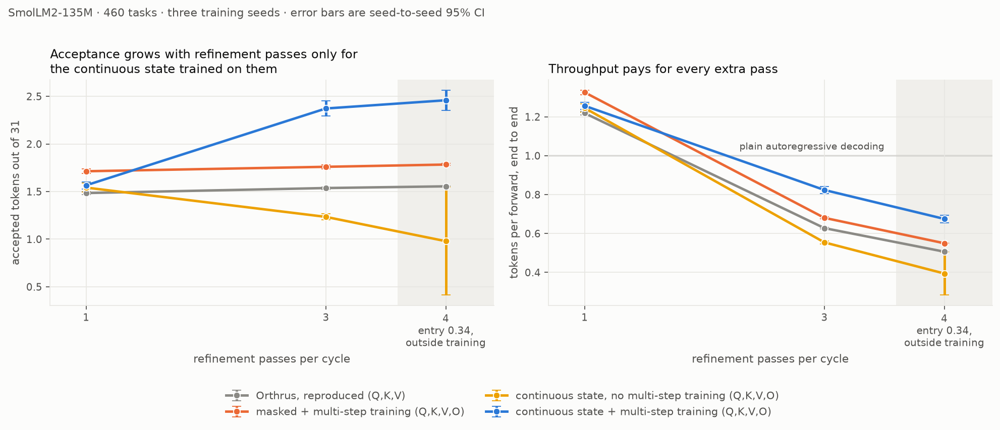
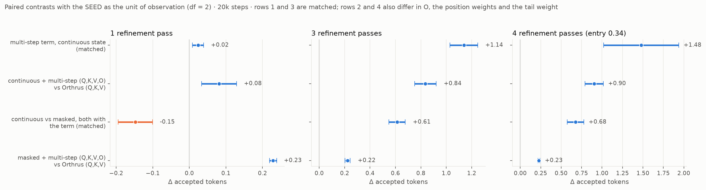
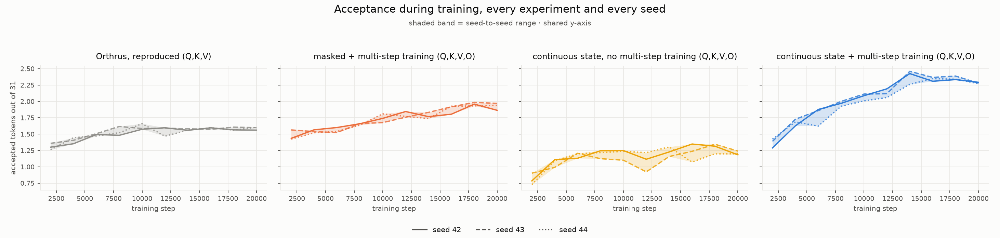
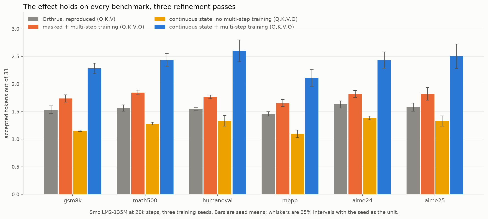
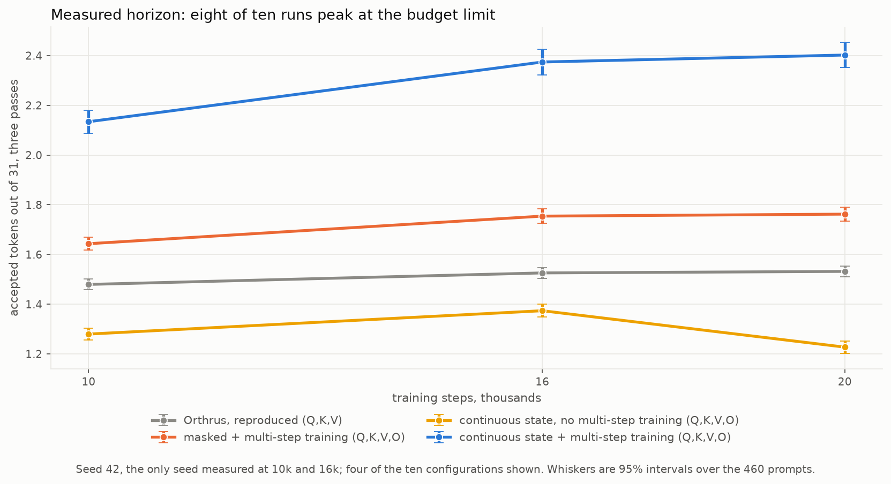

Training curves for every logged loss term and every logged metric, across all
three seeds, are in [step 6 of the Quickstart](#6-training-curves-and-figures):
colour is the experiment, line style is the seed, so how tightly the three
styles of one colour overlap *is* the between-seed spread.

Untrained multi-step refinement is not merely worse but *unpredictably* worse:
at four passes the three seeds give 1.227 / 0.933 / 0.778 (σ = 0.228), while
every other run's between-seed σ stays within 0.05.

## Results, second scale point: Qwen3-0.6B (August 2026)

**This is a scale check, not a second set of claims.** One training seed, so
nothing here carries a between-seed interval and nothing here should be read as
independent confirmation at the strength of the 135M study. What it can do — and
does — is show that the mechanism survives a 4.4× larger backbone, and that the
direction of every contrast is the same.

Five configurations at a **matched budget of 10,000 optimizer steps**, effective
batch 16 — 41M tokens, 0.231 per trainable parameter on Q,K,V,O (0.34–0.35 on
Q,K,V) against the 135M bench's 0.377, counted the same way. Measured exactly as the first scale point: 460 prompts from six
benchmarks at four refinement schedules, 120 decode measurements, output
identical to greedy AR in every one of them.

**The signature reproduces at 0.6B.** Extra refinement passes keep paying only
for the drafter trained on its own refinement; the other configurations are flat
whatever their objective.

| accepted tokens per cycle | 1 pass | 2 | 3 | 4 passes | growth |
|---|---|---|---|---|---|
| Orthrus, reproduced (Q,K,V) | 1.837 | 1.850 | 1.883 | 1.900 | +0.062 ± 0.010 |
| masked + multi-step training (Q,K,V,O) | 2.007 | 2.023 | 2.045 | 2.081 | +0.071 ± 0.013 |
| continuous state, no multi-step (Q,K,V,O) | 1.705 | 1.724 | 1.749 | 1.749 | +0.035 ± 0.015 |
| continuous + multi-step (Q,K,V,O) | 1.952 | 2.501 | 2.882 | 2.997 | +0.995 ± 0.048 |
| **continuous + multi-step (Q,K,V)** | **2.088** | **2.772** | **3.288** | **3.557** | **+1.414 ± 0.053** |

Multi-step training on the *masked* state grows no faster than Orthrus without
it at all. The term is not what pays — the state that carries it is.

The same measurements in throughput, which is what a deployment pays in. One
pass is the operating point for every configuration; beyond it the extra
forwards cost more than the acceptance they buy, and by four passes everything
is below plain autoregressive decoding.

| tokens per forward | 1 pass | 2 | 3 | 4 passes |
|---|---|---|---|---|
| Orthrus, reproduced (Q,K,V) | 1.419 | 0.950 | 0.721 | 0.580 |
| masked + multi-step training (Q,K,V,O) | 1.504 | 1.008 | 0.761 | 0.616 |
| continuous state, no multi-step (Q,K,V,O) | 1.353 | 0.908 | 0.687 | 0.550 |
| continuous + multi-step (Q,K,V,O) | 1.476 | 1.167 | 0.971 | 0.799 |
| **continuous + multi-step (Q,K,V)** | **1.544** | **1.257** | **1.072** | **0.911** |


**The output projection was costing us, and dropping it removes the confound.**
Every configuration except the reproduced baseline used to adapt Q, K, V *and
O*, half again as many trainable parameters as the paper's three projections — so "we beat
Orthrus" was never a matched claim. Training the same continuous multi-step
configuration on Q, K, V alone makes it **better**, not worse, and the
comparison against the baseline is now like-for-like:

| contrast | 1 pass | 4 passes |
|---|---|---|
| **continuous + multi-step vs Orthrus, same projections** | **+0.243** ± 0.025 | **+1.595** ± 0.059 |
| cost of adapting O as well | +0.140 ± 0.027 | +0.559 ± 0.047 |
| continuous (Q,K,V) vs masked (Q,K,V,O), both multi-step — projections differ | +0.081 ± 0.026 | +1.424 ± 0.053 |
| continuous vs masked, both multi-step, both Q,K,V,O | −0.059 ± 0.025 | +0.865 ± 0.050 |
| multi-step training, continuous state (Q,K,V,O) | +0.241 ± 0.027 | +1.200 ± 0.054 |

**Compared with 135M, at the same schedule.** The first scale point states its
contrasts at three refinement passes, so these are the numbers to set beside
them — not the four-pass column above, which would flatter this backbone:

| contrast, three refinement passes | SmolLM2-135M | Qwen3-0.6B |
|---|---|---|
| multi-step training, continuous state (Q,K,V,O) | +1.138 ± 0.109 | +1.080 ± 0.049 |
| best run (Q,K,V,O) vs reproduced Orthrus (Q,K,V) | +0.835 ± 0.085 | +0.936 ± 0.051 |
| the same with matched projections (Q,K,V) | — | +1.356 ± 0.051 |

The multi-step contrast is the same at both scales within its intervals — it
does not shrink, and it does not grow either. What does grow is the margin over
the baseline, and most of that comes from dropping the output projection.

The earlier reversal on this backbone — an untrained-looking continuous branch
on a laptop run — was undertraining, not a property of the method: that run saw
0.058 tokens per trainable parameter, 6.5× less than the 135M bench.

**Extra passes still do not pay in throughput, for any configuration.** Tokens
per forward falls from 1.544 to 0.911 for the best run, below plain decoding by
four passes.
The break-even condition `A(n+1) − A(n) > TPF(n)` fails at every transition. One
pass remains the operating point, and there the best run is **1.544 against
Orthrus's 1.419** — +8.8%, close to the +9.2% that the 135M bench's best
single-pass configuration gains on the same steady-state measure.

**Limits, stated up front.** One seed, so the between-run intervals use the
prompt as the unit of observation and do not carry between-seed spread; the
growth contrasts are within-model and paired, which is what they are for. The
Q,K,V run still differs from the baseline in position weights and a chain-tail
weight even though the projections now match. And nothing has converged —
validation loss is still falling for all of them at 10k, so this is a matched
budget rather than a settled state. Whether O would catch up given more steps is
open: it carries 49% more trainable parameters and is behind on held-out
acceptance while *ahead* on teacher-forced agreement, which is the opposite of
what a simply-undertrained model looks like, but two budgets would settle it and
we measured one.

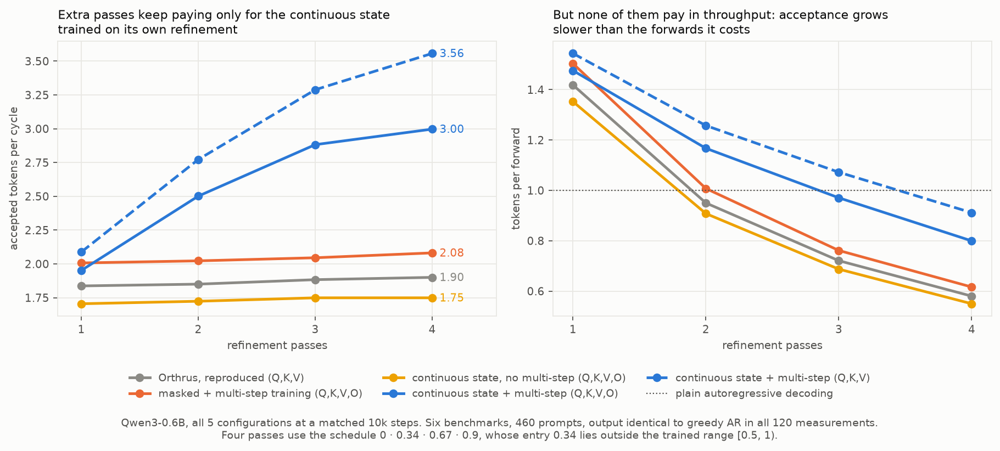
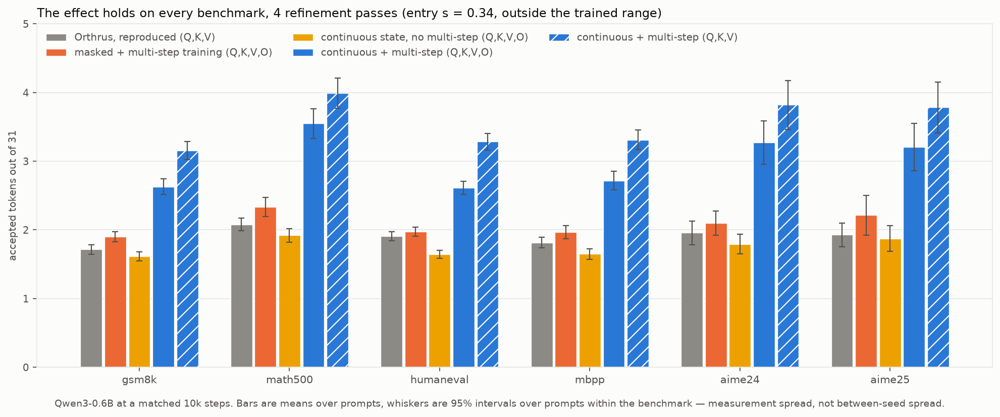
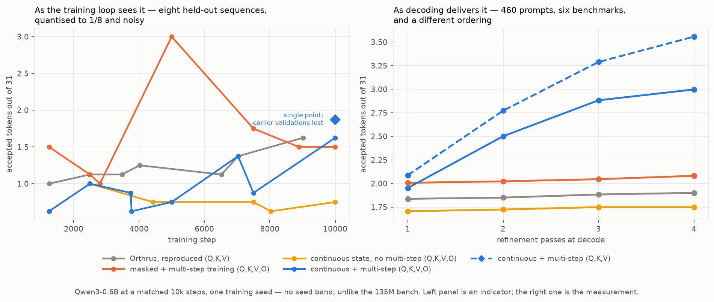
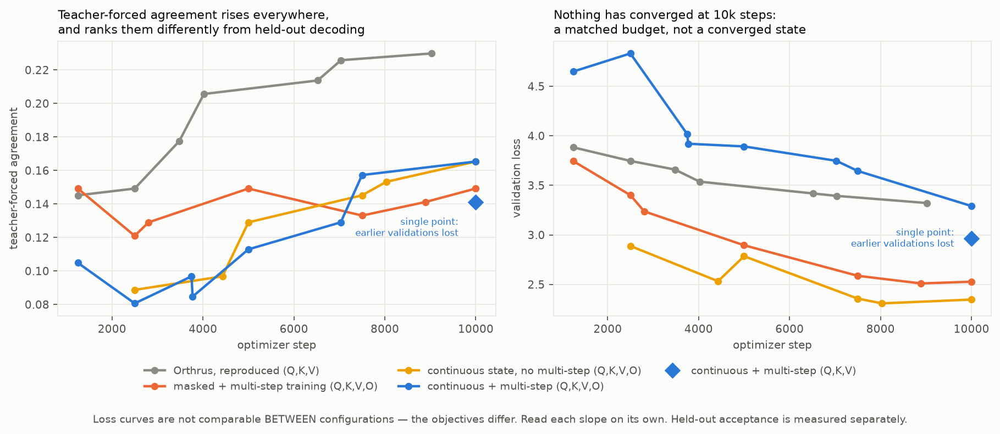

The per-benchmark figure answers whether the average is carried by one dataset:
it is not — the ordering is the same on all six, and the Q,K,V run leads
everywhere. Whiskers there are 95% intervals over prompts within a benchmark,
so they show measurement spread, not the between-seed spread the 135M figures
carry.

The last two figures are the caution. In-training teacher-forced agreement
ranks the configurations differently from held-out decoding — it puts Orthrus
first at every step, while decoding puts it fourth — which is the same proxy
failure the 135M study documents, now visible on a second backbone. In-training
acceptance is read from eight held-out sequences and is quantised to 1/8, so it
shows a trajectory and nothing finer; the decode measurement beside it rests on
460 prompts.

The budget caveat this section ends on is lifted in the next one: the reproduced
baseline and the Q,K,V flow map were both carried to 80,000 steps and measured
again, with a decode schedule that stays inside the range the refinement term was
trained on.

## Results at the full budget: Qwen3-0.6B to 80,000 steps (September 2026)

**What this section adds.** The 10k section above is a matched-budget snapshot of
five configurations; it ends by saying nothing has converged. This one takes the
two configurations that matter — the reproduced Orthrus baseline and the flow map
on the same three projections — to **80,000 optimizer steps each**, and measures
them the same way. Orthrus spent 74.9 hours of training across nine sessions, the
flow map 110.5 across twelve; the step counts are identical, which is what the
comparison rests on. Two things are new besides the budget: a **decode schedule
that stays inside the range the refinement term was trained on**, and the first
wall-clock numbers from a real GPU rather than a laptop.

**Acceptance.** Sixty measurements, 460 prompts from six benchmarks, every one
bitwise-identical to greedy AR.

| accepted tokens per cycle | 1 pass | 2 | 3 | 4 passes | growth |
|---|---|---|---|---|---|
| Orthrus, reproduced (Q,K,V) | 2.201 | 2.215 | 2.258 | 2.312 | +0.096 ± 0.017 |
| **continuous state + multi-step (Q,K,V)** | **2.576** | **3.265** | **3.740** | **4.189** | **+1.559 ± 0.066** |

Paired by prompt, the margin is **+0.360 ± 0.035** at one pass (ahead on 81% of
prompts), **+0.998 ± 0.047** at two (99%), **+1.423 ± 0.059** at three (459 of
460) and **+1.823 ± 0.073** at four (**all 460**). The per-benchmark breakdown at three passes is uniform: math500
+1.732, aime25 +1.742, aime24 +1.612, mbpp +1.323, gsm8k +1.294, humaneval
+1.190.

**The margin did not shrink with training — it grew.** Against the 10k section:
at one pass +0.243 → **+0.360**, at three +1.356 → **+1.423**. An intermediate
measurement taken at 42k against 33k steps appeared to show the opposite, but
those budgets were not matched and the apparent narrowing was the gap in steps,
not a property of the method.

**Throughput, and the schedule that was costing us a pass.** The four-pass
schedule used in every earlier table enters the refinement chain at `s = 0.34`.
Training places its two refinement entries in `[0.5, 0.75)` and `[0.75, 1)` —
`train.selfcorrect_s_min` is 0.5 — so that entry asks the drafter to refine from
a state it has never seen, where two thirds of the input is prior noise arriving
through a frozen embedding. It costs **−0.762 ± 0.050** accepted tokens against
the three-pass schedule, degrading 92–100% of the prompts on every one of the six
benchmarks. Moving the entries inside the trained range (`0 · 0.5 · 0.7 · 0.85`) turns a
loss into the best result of the campaign: **2.974 → 4.189**.

Orthrus is the control that makes this an explanation rather than a story: it has
no self-correction and no `s_min`, and its two four-pass schedules return **the
identical number on every one of the 460 prompts** (`+0.000 ± 0.000`). Only the
number of passes reaches it; where they start does not. That is also direct
evidence, with no theory in it, that the continuous branch is a map in `s` rather
than a repeated projection under another name.

| tokens per forward | 1 pass | 2 | 3 | 4 passes |
|---|---|---|---|---|
| Orthrus, reproduced (Q,K,V) | 1.601 | 1.072 | 0.814 | 0.662 |
| **continuous state + multi-step (Q,K,V)** | **1.788** | **1.422** | **1.185** | **1.038** |

The break-even condition `A(n+1) − A(n) > TPF(n)` still fails at every transition
for both drafters, so **one pass remains the operating point** and the paper's
conclusion about single-step projection stands. What changes is the penalty: the
flow map stays above plain decoding in tokens per forward at every schedule,
where the baseline drops below it from three passes on.

**Wall-clock, measured on a T4 rather than a laptop.** The 135M section reports
that its throughput gain could not be resolved in seconds, because at that size a
forward is dominated by fixed overhead. On a real GPU it does:

| wall-clock speedup over plain decoding | 1 pass | 2 | 3 | 4 passes |
|---|---|---|---|---|
| Orthrus, reproduced (Q,K,V) | 1.347 | 0.906 | 0.693 | 0.564 |
| **continuous state + multi-step (Q,K,V)** | **1.440** | **1.130** | **0.929** | **0.805** |

Both drafters are faster than autoregressive decoding at one pass; only the flow map
is still faster at two. These numbers are a T4 at `float32` with the dense
attention path, batch one — the regime in which decoding is bound by reading the
weights, not by arithmetic.

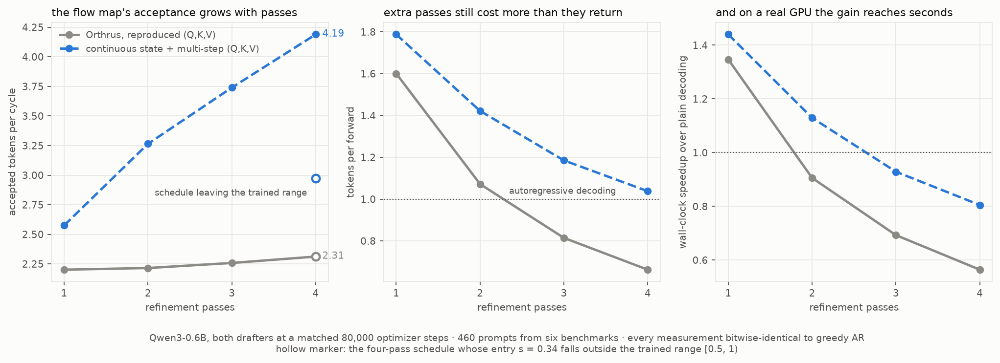
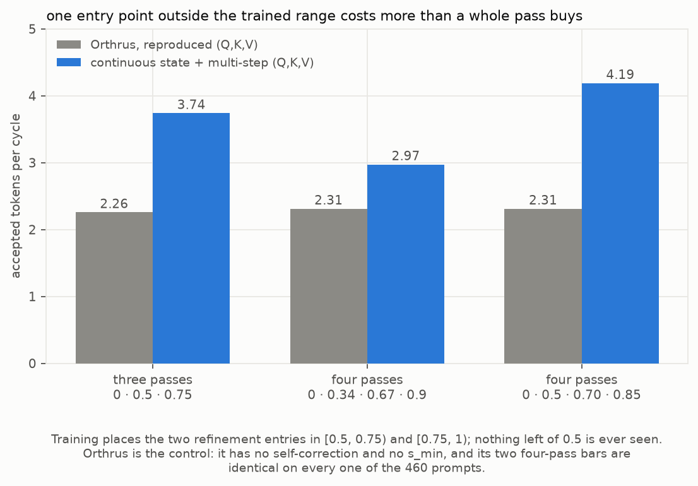
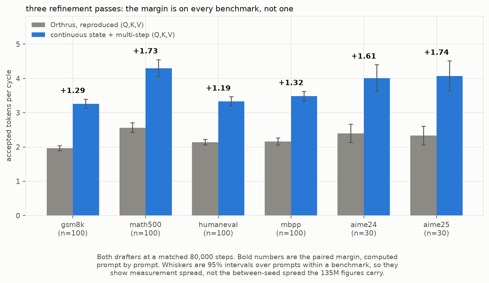

**Limits, unchanged from the section above.** One training seed per drafter, so the
intervals use the prompt as the unit of observation and answer "will this hold on
other tasks", never "will this hold on another training run". The two drafters still
differ in position weights and a chain-tail weight even though the projections
match. And the four-pass column of every earlier table in this README — 10k
included — was measured with the out-of-range schedule. At 80k that schedule
shows about a quarter of the growth the corrected one delivers; at 10k and at
135M the corrected schedule was not measured, so how far those columns
understate the method is not known.

## Porting to Qwen3-1.7B, the paper's own scale

The baseline and the method have Qwen presets reproducing the
paper's Table 4 hyperparameters exactly (2048 tokens, 256 anchor blocks, block
size 32, two epochs over 600k examples, peak LR 2e-4 cosine with 5% warmup,
gradient clipping 1.0, global batch 128, 1:1:1 chat/math/code).

```bash
# reference point: Orthrus as the paper's text describes it — W_Q, W_K, W_V only
# (the released weights also train W_O; on Qwen3-0.6B that is qwen06_orthrus_qkvo)
./hf-auth.sh uv run python src/train.py +experiment=qwen_orthrus

# continuous state trained on its own refinement procedure — the main result
./hf-auth.sh uv run python src/train.py +experiment=qwen_flowdraft_multistep
```

Measure a checkpoint. `model.backbone.dtype=float32` is required for the
losslessness assertion — under bf16 the verifier's arithmetic breaks bitwise
agreement on near-ties. `decode.jumps` takes restart pairs; an integer expands
to passes at `t<1` that nothing in the objective trains when the consistency
terms are off.

```bash
./hf-auth.sh uv run python src/eval.py \
    checkpoint=checkpoints/qwen_flowdraft_multistep/last.ckpt \
    data=math500 decode.block_size=32 decode.n_prompts=100 \
    "decode.jumps=[[0,1],[0.5,1],[0.75,1]]" \
    model.backbone.dtype=float32 \
    per_prompt_file=results/qwen-per-prompt.jsonl

uv run python bench/analyze.py --data results   # CIs, Holm, RM-ANOVA, bootstrap
```

**Hardware the paper used, and what changes on an A100.** Orthrus trained on a
single node of **8×H200** with FSDP-2, micro-batch 1 and 16 accumulation steps,
using FlexAttention with the **FlashAttention-4** backend for its custom masks.
FA4 needs Hopper or newer, so on an A100 it is simply unavailable — and this
repository already defaults to `flex_attention_backend=triton`, which is the
correct choice there. That is a speed and availability difference, not a
fidelity one: the sparse and dense masks were checked against each other over
4,981 (query, key) pairs with zero disagreement.

Global batch 128 is micro-batch 1 with accumulation 128 on one device or 16 on
eight, and the per-device footprint is identical, so a single A100 can hold the
run — it simply takes eight times as long.

**Memory, single device, micro-batch 1.** Weights and optimizer state come to
**6.2 GiB**: 3.17 for the frozen bf16 backbone, 0.44 for the 235M trainable
projections, and 2.62 for the fp32 master copy plus AdamW's two moments — the
baseline's Q, K, V; the method preset's Q, K, V, O come to 352M and about 7.8 GiB. What
the arithmetic does not cover is activations, and there the diffusion path is
**four times the length of the autoregressive one** — 256 blocks × 32 = 8,192
rows against 2,048 tokens. That, not the weights, decides whether a 40 GB card
is enough, and it should be measured rather than argued: run 20 steps with
`trainer.accumulate_grad_batches=1` and read the peak.

**One knob does not transfer.** `acceptance_profile` states the acceptance
regime the position weights aim at. It is 0.8 on both bench scales and 0.93 in
the Qwen3-1.7B presets, interpolated from the paper's own numbers (TPF 6.35 at acceptance
length 11.7 solves to a = 0.929). Getting it wrong is not free: at 0.93
positions 8–31 carry ~48% of the gradient mass, at 0.6 about 3%. Every run logs
per-position acceptance, so derive it from the data and retrain if it moved.

**Exercised on one device only.** The sparse FlexAttention path has run on a
T4 (`FLOWDRAFT_DF_ATTENTION=auto`); collective operations and the rank seed
offset have never run on more than one device. Run one short job before
committing to a long one.

## Defects found and fixed

Each with a measured before and after:

| | before | after |
|---|---|---|
| commit widths in multi-step training | `[16, 31]` — the second pass supervised a block with no masks left | `[10, 21]`, matching decode exactly |
| validation schedule given as an integer | two passes of three ran at `t<1`, where no term provides gradient | restart pairs matching what is trained |
| position weights across the two branches | different dtype, 2.828 vs 2.824 | bitwise identical |
| mixed-benchmark validation | crashed on nested Hydra initialisation | works |
| schedule parsing for pair form | crashed on `ListConfig` | all five input forms |
| dead forward when consistency terms are off | 3 and 7 backbone forwards per step | 2 and 6; step time 0.18 s → 0.11 s |
| time conditioning consumed the global RNG | one architecture saw different data at the same seed | reseed after model construction |
| `eval.py` | measured a block-32 model at block 8; crashed writing paired schedules | fixed |
| `min_jump_gap` | justification was wrong: the gradient at `s≈t` is `O(t−s)`, not zero | left at 0, later removed with the CFM terms |

Portability: the CUDA path no longer refuses non-Qwen3 backbones; the
finite-loss check and the crash-checkpoint decision are collective; the seed is
offset by rank; all three teacher modes are chunked (6.09 GB → 0.75 GB at the
paper preset); `val_check_interval` in the paper presets counted loader batches
— 3.9 optimizer steps instead of 250.

Losslessness needs `model.backbone.dtype=float32`: under bf16 the verifier's
arithmetic breaks bitwise agreement on near-ties (5 of 6 vs 6 of 6).

Rejected configurations are kept outside the repository (`bucket/`, not
shipped); their numbers are in §8 of [EXPERIMENTS.md](EXPERIMENTS.md). Objective
assumptions that code cannot remove are in §9, including one measured and found
unsatisfied.

## Overview

Autoregressive (AR) LLMs decode strictly sequentially: generating *L* tokens costs *L* forward passes, which is memory-bandwidth bound. Diffusion LMs can draft whole blocks in parallel, but they drift from the AR distribution and lose quality. Speculative-style verification restores quality: draft a block in parallel, then verify it against the AR model in a single pass and keep only the tokens the AR model would have produced — this is **lossless**.

**FlowDraft** upgrades the *drafter* inside a lossless parallel-decoding loop. The throughput of any verify-based system is governed by its **acceptance length** — the number of drafted tokens accepted per cycle. We replace the single-step masked-diffusion drafter with a **Categorical Flow Map** drafter that keeps the draft as a continuous state and is trained on its own refinement chain, so that a refinement pass can improve the draft it receives. Verification is left untouched, so the output stays strictly lossless — the drafter affects only **speed**, never **quality**.

Crucially, the AR model is what does the verifying, so it is kept **frozen throughout**. Keeping it untouched is exactly what makes the output provably identical to the base model; it is what the word *lossless* rests on.

## Quickstart

The full campaign, in the order it has to run. Every step is resumable on its
own: training restarts from `last.ckpt`, and measurement skips any combination
already present in its output file, so an interrupted sweep is re-launched with
the same command.

### 1. Setup (once)

```bash
git clone https://github.com/adelardw/FlowDraft.git && cd FlowDraft
uv sync
echo "HF_TOKEN=hf_..." > .env          # read by hf-auth.sh; optional for these public backbones
./hf-auth.sh                           # verify: prints your HF username
```

Check inference before training anything — the **untrained** drafter is already
lossless, just slow:

```bash
./hf-auth.sh uv run python main.py -p "Once upon a time"
#   -> generation + [lossless vs AR (bitwise): PASS]
```

### 2. Sparse attention: FlexAttention and FlashAttention-4

The masked baseline drafts up to 256 isolated blocks per step, so its attention
mask is sparse by construction. Three backends implement the *same* mask —
causal into the cached prefix, bidirectional within a block, nothing across
blocks — and differ only in speed:

| backend | override | where it runs |
|---|---|---|
| FlexAttention + Triton | `model.adapter.flex_attention_backend=triton` | every CUDA architecture; the stable default |
| FlashAttention-4 | `model.adapter.flex_attention_backend=flash` | Hopper / Blackwell only (compute capability >= 9) |
| dense additive mask | chosen automatically | CPU, Apple Silicon, CUDA builds without FlexAttention |

FA4 ships as a prerelease and is deliberately **not** a project dependency, so
CPU and macOS environments stay lightweight. On the CUDA node:

```bash
uv pip install ninja packaging
uv pip install --prerelease=allow --no-build-isolation "flash-attn-4[cu13]"

# verify BOTH before committing to a long run
uv run python -c "from torch.nn.attention.flex_attention import flex_attention; print('FlexAttention: OK')"
uv run python -c "import flash_attn; print('flash-attn: OK')"
```

Then append `model.adapter.flex_attention_backend=flash` to the training
commands below. Asking for `flash` on a pre-Hopper card is refused with a
message rather than silently downgraded.

### 3. Train every experiment

One command per configuration, each self-contained. Every configuration lives in
`src/configs/experiment/`; the command differs only in the preset name, because
everything a comparison must hold fixed lives in the shared base the preset
inherits. The data, budget and batch of the reported runs were set on top of
the presets; each scale below lists them.

#### SmolLM2-135M — the first scale point

Drop `model.adapter.flex_attention_backend` here: at this scale the dense mask
is used and the override does nothing. To replicate a configuration on another
seed, add `seed=43 output_dir=checkpoints/s43/<name>`.

```bash
# Orthrus EXACTLY as published — not one of our additions is present. This is
# the only point at which the reproduction is compared with the paper.
./hf-auth.sh uv run python src/train.py +experiment=smollm_orthrus \
    output_dir=checkpoints/smollm_orthrus

# THE MAIN CLAIM at bench scale: flow map trained on its own multi-step
# procedure.
./hf-auth.sh uv run python src/train.py +experiment=smollm_flowdraft_multistep \
    output_dir=checkpoints/smollm_flowdraft_multistep

```


#### Qwen3-0.6B — the second scale point

The bench geometry of the 135M runs — block size 32, one anchor block, context
256 — on a larger backbone. Not the paper's setup — do not compare these
against its Table 1. The reported runs were trained on Kaggle T4s with these
settings on top of the presets: a fixed pool of 360,000 Nemotron examples
(chat, code, math) packed into 256-token sequences, `trainer.max_steps=10000`
or `80000`, `trainer.precision=bf16-mixed`, and an effective batch of 16 —
`data.batch_size=16`, or `8` with `trainer.accumulate_grad_batches=2` where
memory required it; the 80k runs validated on `data.val_size=256`. The presets
alone stream the whole dataset with batch 2 for 20,000 steps.

```bash
# Orthrus at this scale: W_Q, W_K, W_V only, no position weights.
./hf-auth.sh uv run python src/train.py +experiment=qwen06_orthrus \
    output_dir=checkpoints/qwen06_orthrus

# Continuous state trained on its own refinement, adapting Q, K, V and O.
./hf-auth.sh uv run python src/train.py +experiment=qwen06_flowdraft_multistep \
    output_dir=checkpoints/qwen06_flowdraft_multistep

# THE SAME, on Q, K, V alone — the projection set the baseline uses. This is
# the configuration that leads at this scale, and the one whose comparison
# against Orthrus is like-for-like.
./hf-auth.sh uv run python src/train.py +experiment=qwen06_flowdraft_multistep_qkv \
    output_dir=checkpoints/qwen06_flowdraft_multistep_qkv

# Orthrus as RELEASED: the authors' weights train W_O too, so this adds it.
# Paired with qwen06_flowdraft_multistep above (also Q, K, V, O); the running
# pair uses the settings above with trainer.max_steps=100000.
./hf-auth.sh uv run python src/train.py +experiment=qwen06_orthrus_qkvo \
    output_dir=checkpoints/qwen06_orthrus_qkvo

# The same two with a hybrid diffusion view: 18 components replaced by linear
# maps distilled from what the frozen components compute (EXPERIMENTS.md §7.2).
./hf-auth.sh uv run python src/train.py +experiment=qwen06_orthrus_qkvo_linear \
    output_dir=checkpoints/qwen06_orthrus_qkvo_linear
./hf-auth.sh uv run python src/train.py +experiment=qwen06_flowdraft_multistep_linear \
    output_dir=checkpoints/qwen06_flowdraft_multistep_linear
```

#### Qwen3-1.7B — the baseline and the method

At the paper's hyperparameters: 2048 tokens, 256 anchor blocks, block size 32,
two epochs over 600k examples, peak LR 2e-4 cosine with 5% warmup, gradient
clipping 1.0, global batch 128.

```bash
# Orthrus verbatim: the diffusion attention trains W_Q, W_K, W_V and nothing
# else — no output projection, no per-head norms, no position weights.
./hf-auth.sh uv run python src/train.py +experiment=qwen_orthrus \
    output_dir=checkpoints/qwen_orthrus \
    model.adapter.flex_attention_backend=flash

# THE MAIN RESULT. Continuous state trained on its own refinement procedure:
# the drafter proposes, one frozen forward over that proposal supplies both
# the target and the greedy verdict.
./hf-auth.sh uv run python src/train.py +experiment=qwen_flowdraft_multistep \
    output_dir=checkpoints/qwen_flowdraft_multistep \
    model.adapter.flex_attention_backend=flash
```

**Four presets are bases, not experiments.** `smollm_base`, `qwen06_base` and
`qwen_base` hold what every configuration at that scale must agree on for a
contrast to be readable; `qwen06_linear_base` holds the linearization plan the two
hybrid runs share. They are meant to be inherited rather than run. Run on its
own, a base falls back to the repository default `train.variant=flowdraft` — the
full-sequence geometry whose only loss was the trajectory-structure objective,
measured and rejected ([EXPERIMENTS.md](EXPERIMENTS.md) §8) — and training stops
with an error that says so.

#### All of them in sequence

Runs go **one at a time**: on a single device parallel runs contend for the same
memory and the timings stop being comparable. The loop resumes anything already
started.

```bash
EXPERIMENTS="smollm_orthrus smollm_flowdraft_multistep"

for seed in 42 43 44; do
  out=checkpoints; [ $seed = 42 ] || out=checkpoints/s$seed
  for exp in $EXPERIMENTS; do
    resume=""
    [ -f "$out/$exp/last.ckpt" ] && resume="resume_from_checkpoint=$out/$exp/last.ckpt"
    ./hf-auth.sh uv run python src/train.py +experiment=$exp \
        seed=$seed output_dir=$out/$exp $resume
  done
done
```

Watch `val/acceptance_decode` rise and `val/loss/verify_kl` fall. Checkpoints
hold the FP32 drafter head and its Adam moments; the frozen backbone is not
stored. For multi-GPU, hand the run to Lightning's DDP:

```bash
./hf-auth.sh uv run python src/train.py +experiment=qwen_flowdraft_multistep \
    trainer.accelerator=gpu trainer.devices=8 trainer.strategy=ddp \
    trainer.accumulate_grad_batches=16
```

Training always disables `model.backbone.device_map` — Hugging Face device maps
are inference sharding, while DDP needs one complete replica per GPU. Streaming
train and validation datasets are split into disjoint, equal rank shards, then
partitioned among DataLoader workers. `data.batch_size` is per GPU; reach a
larger global batch with `trainer.accumulate_grad_batches`.

### 4. Validate on every dataset

Six benchmarks, 460 tasks. `model.backbone.dtype=float32` is **required** for
the losslessness assertion — under bf16 the verifier's arithmetic breaks bitwise
agreement on near-ties. `per_prompt_file` is what makes the statistics possible:
without it only means are written, and no interval, contrast or ANOVA can be
built from means alone.

```bash
CKPT=checkpoints/qwen_flowdraft_multistep/last.ckpt

for ds in gsm8k:100 math500:100 humaneval:100 mbpp:100 aime24:30 aime25:30; do
  ./hf-auth.sh uv run python src/eval.py \
      checkpoint=$CKPT data=${ds%%:*} decode.n_prompts=${ds##*:} \
      decode.block_size=32 decode.max_new_tokens=64 \
      "decode.jumps=[[0,1],[0.5,1],[0.75,1]]" \
      model.backbone.dtype=float32 \
      results_file=results/aggregate.jsonl \
      per_prompt_file=results/pp-qwen.jsonl
done
```

AIME 24 and 25 hold 30 tasks each — that is the whole set, not a subsample.
`decode.jumps` takes restart pairs; an integer expands to passes at `t < 1`, which
nothing in the objective trains once the consistency terms are off. Sweep the
schedule by repeating the loop with `decode.jumps=1`, `[[0,1],[0.5,1]]` and the
four-pass form.

### 5. Metrics and statistics

```bash
uv run python bench/analyze.py --data results
```

Prints, in order: acceptance per experiment with Student intervals; every paired
contrast with Holm correction; repeated-measures ANOVA with the
Greenhouse-Geisser correction; the per-dataset breakdown; stratified bootstrap,
sign test and Wilcoxon across datasets; and rank stability across prompt folds
by Kendall tau. The unit of observation is the **prompt**, and the header states
plainly how many training seeds stand behind the numbers — resampling prompts
answers "will this hold on other tasks", never "will this hold on another
training run".

Useful flags: `--step` (which snapshot), `--sched` (`n1`/`n2`/`n3`/`n4`),
`--metric acceptance|tpf`, `--folds`.

### 6. Training curves and figures

```bash
uv run python bench/curves.py     # every loss term, every metric, per seed
```

`bench/curves.py` reads the TensorBoard scalars each run writes under
`checkpoints/**/lightning_logs/` and produces three figures — `curves_loss`,
`curves_metrics` and `curves_seeds` — in which colour is the experiment and line
style is the training seed, so "do the experiments differ" and "do the seeds
agree" stay separate questions. Terms carrying weight zero are named in the
caption instead of being drawn as a flat line on an invented axis.

**`bench/figures.py` is stale and is deliberately not listed above.** It dates
from the earlier 6000-step, five-configuration bench, its labels are in Russian,
and it writes `contrasts.png` — so running it would overwrite a current figure
with an outdated one. The four result figures of the 135M section
(`multistep`, `contrasts`, `per_benchmark`, `horizon`) are rebuilt from the
per-prompt data by `bench/smollm_figures.py`; the Qwen3-0.6B figures come from
`bench/qwen06_*.py`.

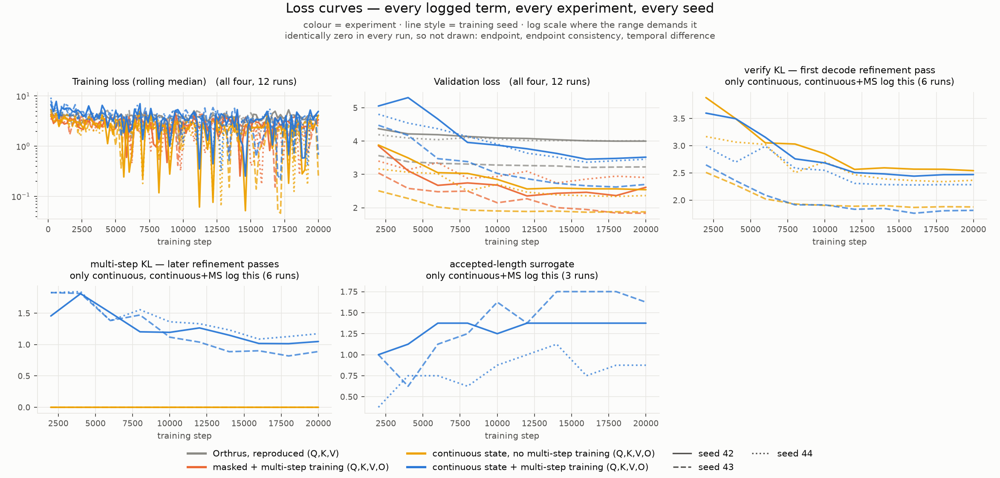
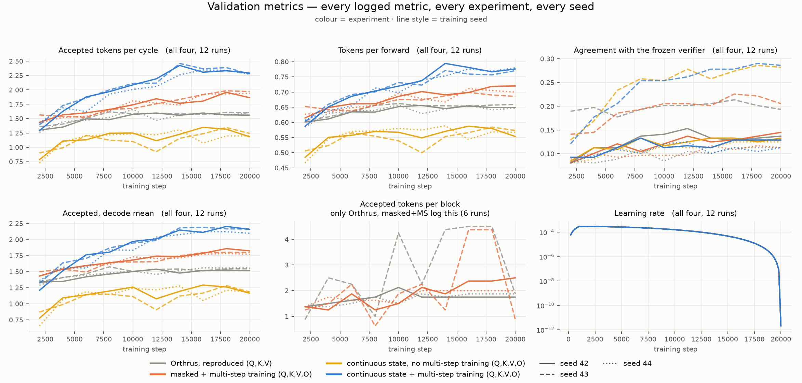

Live monitoring during a run: `uv run tensorboard --logdir checkpoints`.

Laptop debugging: `src/train.py` and `src/eval.py` also run on a small ungated
backbone — append the hydra overrides
`model.name=HuggingFaceTB/SmolLM2-135M-Instruct model.backbone.dtype=float32
model.backbone.device_map=null`.


## Experiments

The baseline and the method across three backbones, each a preset in
`src/configs/experiment/`; on Qwen3-0.6B also the method on Q, K, V alone,
Orthrus as its weights are released (Q, K, V, O) and the hybrid diffusion view. What each one tests, the loss written out term by term, the
results and the statistics are in **[EXPERIMENTS.md](EXPERIMENTS.md)**; the
commands that launch them are in
[step 3 of the Quickstart](#3-train-every-experiment).

| experiment | SmolLM2-135M | Qwen3-0.6B | Qwen3-1.7B |
|---|---|---|---|
| Orthrus, reproduced | `smollm_orthrus` | `qwen06_orthrus` | `qwen_orthrus` |
| continuous state + multi-step | `smollm_flowdraft_multistep` | `qwen06_flowdraft_multistep` | `qwen_flowdraft_multistep` |
| the same on Q,K,V alone | — | `qwen06_flowdraft_multistep_qkv` | — |
| Orthrus as released, Q,K,V,O | — | `qwen06_orthrus_qkvo` | — |
| hybrid diffusion view (Orthrus / the method) | — | `qwen06_orthrus_qkvo_linear` / `qwen06_flowdraft_multistep_linear` | — |

`smollm_base`, `qwen06_base`, `qwen_base` and `qwen06_linear_base` are the shared
bases these inherit, not experiments. Presets that were measured and rejected —
the masked drafter trained on its own refinement, the continuous state without
it, the trajectory-structure objective, the input gate, the Q/K/O projection
set, the weight-profile controls and the idempotence term — are kept outside the
repository and deliberately not shipped; their numbers are in
[EXPERIMENTS.md](EXPERIMENTS.md) §8.

## Background: the decoding bottleneck

- **AR LLMs** decode strictly sequentially: *L* tokens → *L* forward passes (memory-bandwidth bound).
- **Diffusion LMs** draft blocks in parallel, but drift from the AR distribution and lose quality.
- **Speculative-style verification** fixes quality: draft in parallel, then *verify* against the AR model → keep only correct tokens (**lossless**).

## Host framework: Orthrus

FlowDraft is built inside **Orthrus**, a lossless parallel-decoding scaffold:

- One transformer, two attention paths: a **frozen AR path** and a **lightweight, trainable diffusion path** (~16% of parameters), sharing the same norm / MLP / embeddings and a single KV cache.
- The diffusion path proposes *K* tokens in parallel; the frozen AR head verifies them in one pass → output **provably identical** to the base model. Accepted tokens are committed to the shared KV cache, and the loop continues with the next block.
- Reported by Orthrus: up to **7.8×** faster, training only **~16%** of parameters on **<1B** tokens.

> *These figures describe the Orthrus host framework (prior work), not FlowDraft's own results.*

## The problem

- Throughput of any verify-based system = **acceptance length** (drafted tokens accepted per cycle).
- Orthrus's drafter is a **single-step masked diffusion** model → it assumes block positions are conditionally independent → drafts diverge → tokens get rejected.
- Refining the draft would help, but **adding a step costs a forward pass** and lowers throughput.
- We need a **better proposal per pass**, not more passes.

## Key idea: a Categorical Flow Map drafter

*The pitch of the original project brief. Measured since: the drafter is
mean-field, a continuous state alone does not beat masking at one pass, and
what pays is training it on its own refinement chain — see the results
sections.*

- **Categorical Flow Maps** [Roos et al., 2026] learn the *integrated, correlated* endpoint distribution on the simplex and generate in **one or few jumps**.
- Use it as the drafter: a **higher-fidelity joint proposal** over the block — at the **same pass count**.
- Verification is unchanged → output stays **strictly lossless**; the drafter only affects *speed*, never *quality*.
- **Novelty:** a flow-map drafter inside Orthrus, trained on its own refinement chain against the frozen verifier. The flow-map consistency losses it started from were measured, found harmful and dropped ([EXPERIMENTS.md](EXPERIMENTS.md) §8).

**Why it matters**

1. **Efficiency** — higher acceptance length = higher throughput, for free.
2. **Fidelity** — speedup with **zero** quality loss (verification guarantees it).
3. **Foundations** — connects flow-map distillation to fast, faithful LLM inference.

## CFM training, in brief

*Where the project started. The self-consistency part below was measured, cost
−0.114 accepted tokens, and was removed; the objective in use is under
[Method](#method).*

The drafter learns two complementary parts of a categorical flow map:

- **Endpoint inference — *what endpoint belongs to the trajectory*.** The diagonal predictor is trained by categorical VFM against the clean endpoint used to construct the interpolant.
- **Self-consistency — *how to jump*.** The reliable diagonal prediction at a transported state teaches the harder long-jump predictor through ECLD.

The ECLD target is stop-gradiented. Verifier alignment lives in `train.verify_kl_weight` (the pair the decode loop executes) and `train.selfcorrect_kl_weight` (the same alignment along the drafter's own jump schedule).

The AR model remains frozen throughout. In paper-faithful CFM training it supplies the cached prefix for the block-wise geometry and validation targets; at inference it verifies every proposal, which is what guarantees losslessness.

## Goals

*The original project brief. What was kept and what was measured and dropped is
in [EXPERIMENTS.md](EXPERIMENTS.md) §8.*

1. **Reproduce Orthrus** (frozen AR + masked-diffusion drafter, shared KV cache, lossless loop) at a tractable scale.
2. **Implement a flow-map drafter** (simplex endpoint head, 1–few jumps).
3. **Develop the dual distillation objective** (AR-teacher distribution + flow-map consistency).
4. **Evaluate & compare:** AR baseline vs. masked-diffusion Orthrus vs. flow-map drafter — on acceptance length, TPF, and throughput — all verified lossless.

## Expected deliverables

*From the same brief; the objective in use is under [Method](#method).*

1. Reproduction of the Orthrus lossless parallel decoder (masked-diffusion drafter).
2. Implementation of the **Categorical Flow Map drafter** + dual distillation training.
3. Evaluation: acceptance-length / TPF / throughput comparison, with verified losslessness and **block-size / jump-count ablations**.

## Method

One frozen backbone, two attention paths (the Orthrus host), and a Categorical Flow Map drafter trained against the frozen verifier: at the state every decode cycle enters, and along the drafter's own refinement chain.

- **Adapter** (`src/models/base/df_adapter.py`): every projection named in `model.adapter.w_names` — `q/k/v_proj`, plus `o_proj` in the Q,K,V,O presets — gets a trainable twin initialized as a copy of the frozen AR weight (117M parameters for Q, K, V on Qwen3-0.6B). Routing is stateless (`torch.func.functional_call`, the backbone module tree is never modified); everything else — norms, MLP, embeddings, LM head — and one KV cache are shared. The cache is AR-only by contract: the drafter reads the committed prefix, its own K/V are cropped right after each forward. The DF path reads the cached prefix and attends bidirectionally within its block (the dual-pass mask), and is conditioned on the jump times `(s, t)` via a zero-initialized sinusoidal time embedding (`fte.py`).
- **Objective** (`FlowDraftBlockWise.compute_loss`): `loss = verify_kl_weight·verify_KL + selfcorrect_kl_weight·selfcorrect_KL`
  - **verify KL** — `KL(sg(p_AR) ‖ π_{0,1}(x_0))` at the pure prior, the state every decode cycle enters, against the AR distribution conditioned on the accepted prefix.
  - **self-correction KL** — the drafter walks its own refinement chain, and each pass is trained on the frozen verifier's answer to the draft of the pass before it. This is the multi-step term.
  - The three consistency terms of *Categorical Flow Maps* — endpoint on the diagonal, EC and TD — carried zero weight in every shipped preset — the one ablation that switched them on cost −0.114 accepted tokens — and were removed; they and the reasons are in `bucket/cfm_terms`.
- **Training geometries** (`train.variant`): `flowdraft_block_wise` trains FlowDraft in the exact inference geometry, and `orthrus` uses Orthrus' single-step, dual-pass block-causal masked-diffusion geometry with no time conditioning. Both blockwise implementations can flatten several isolated width-K blocks into one drafter pass via `anchors_per_sequence`, sharing one full AR teacher/cache pass. `orthrus_linear` and `flowdraft_block_wise_linear` (`src/models/linear_orthrus.py`) add a hybrid diffusion view: planned components replaced by linear maps distilled from the frozen ones ([EXPERIMENTS.md](EXPERIMENTS.md) §7.2).
- **Decoding** (`FlowDraft.generate`): a width-K block contains one clean pending anchor plus K-1 fresh drafts produced in 1–few jumps, then ONE AR forward verifies the block. The previous cycle's correction/bonus token is never committed by its own pass: it rides as the clean in-block anchor and the next verify forward commits its K/V while scoring the drafts — **cycle cost = `jumps + 1` forwards** (TPF parity with the Orthrus convention). `temperature=0`: greedy verification, output **bit-identical** to `ar_generate`. `temperature>0` with Gumbel-coupled sampling (default): position-keyed Gumbel noise turns sampling into a deterministic argmax — the output is **bit-identical** to sampled `ar_generate` with the same seed. Uncoupled (`coupled=false`): Leviathan speculative sampling, lossless **in distribution**.

## Repository structure

```text
FlowDraft/
├── main.py                        # playground CLI (typer): generate from your prompts
├── hf-auth.sh                     # HF_TOKEN from .env -> env (optional for the public backbones)
├── pyproject.toml                 # uv project; installed as an editable `src` package
├── EXPERIMENTS.md                 # the baseline, the method, upcoming runs — with the mathematics
├── RESEARCHERS.md                 # research themes: prior work, hypotheses, sources
├── docs/                          # research log: comparison ledger, evidence, related work
├── TODO.md                        # the plan of the upcoming runs
├── LICENSE                        # MIT
├── tools/                         # paired contrasts, checks against the released Orthrus, probes
├── results/                       # per-prompt measurements behind the Qwen3-0.6B numbers
├── data/measurements/             # per-prompt measurements behind the SmolLM2-135M numbers
└── src/
    ├── models/
    │   ├── base/df_adapter.py     # FlowDraftAttentionAdapter: frozen AR + trainable DF twins
    │   ├── base/fte.py            # FlowTimeEmbedding (s, t)
    │   ├── model.py               # build_model: backbone + tokenizer + processor
    │   ├── factory.py             # build_lit: variant selection + checkpoint loading
    │   ├── flowdraft.py           # FlowDraft base: lossless generate (the full-sequence variant has no loss)
    │   ├── flowdraft_block_wise.py        # FlowDraft in the inference geometry
    │   ├── linear_orthrus.py      # hybrid diffusion view for Orthrus and FlowDraft
    │   └── orthrus.py             # Orthrus masked drafter, block-causal
    ├── preprocessor/df_processor.py   # tokenization + one-hot simplex endpoints
    ├── data/dataloaders.py        # streaming Dataset / collate / DataLoader;
    │                              #   EpochShuffled: repetitions in a new order (epochs)
    ├── configs/                   # hydra configs
    │   ├── train.yaml             # training entrypoint config
    │   ├── eval.yaml              # evaluation entrypoint config
    │   ├── model/                 # qwen3_1.7b (default) | qwen3_0.6b | qwen2_0.5b | smollm2_135m
    │   ├── data/                  # nemotron (training) | gsm8k, math500, humaneval, mbpp, aime24, aime25
    │   ├── benchmark/             # orthrus: the paper-style evaluation protocol
    │   └── experiment/            # one preset per experiment + shared bases (smollm_*, qwen06_*, qwen_*)
    ├── train.py                   # training entrypoint
    ├── eval.py                    # dataset evaluation: acceptance / TPF / NLL -> results/eval.jsonl
    └── plots.py                   # report figures: frontier / TPF bars / TPF-vs-K
```

## Installation

```bash
git clone https://github.com/adelardw/FlowDraft.git && cd FlowDraft
uv sync
echo "HF_TOKEN=hf_..." > .env     # optional: the backbones are public; a token raises Hub rate limits
./hf-auth.sh                      # verify the token authenticates
```

## Usage

```bash
# generate from your prompts (greedy: bitwise-lossless check included)
./hf-auth.sh uv run python main.py -p "Once upon a time" -p "def main():"
# sampling — bit-exact vs AR too (Gumbel coupling is the default; --no-coupled = lossless in distribution)
./hf-auth.sh uv run python main.py -p "..." --temperature 0.8 --top-k 50 \
    --checkpoint checkpoints/last.ckpt
```

## Training

Data: [nvidia/Nemotron-Post-Training-Dataset-v2](https://huggingface.co/datasets/nvidia/Nemotron-Post-Training-Dataset-v2),
streamed (no full download), category splits interleaved, `messages` rendered
with the tokenizer's chat template (`src/data/dataloaders.py`). Batch contract:
`input_ids [B,T]` + `attention_mask [B,T]`; the `[B,T,V]` simplex is built
on-device, never in the batch.

```bash
./hf-auth.sh uv run python src/train.py +experiment=qwen06_orthrus                  # the baseline, Qwen3-0.6B
./hf-auth.sh uv run python src/train.py +experiment=qwen06_flowdraft_multistep_qkv   # the method, Qwen3-0.6B
```

Variants: `orthrus` is the paper-style block-causal Orthrus recipe (frozen AR
cache plus independently anchored masked blocks), and `flowdraft_block_wise`
trains the flow-map drafter in that inference geometry; the `*_linear` variants
add the hybrid diffusion view. The full-sequence `flowdraft` variant has no loss
left and refuses to train.
Knobs live in `configs/train.yaml`: `verify_kl_weight`/`selfcorrect_kl_weight`
(the two terms), `selfcorrect_rounds`/`selfcorrect_s_min` (the refinement chain),
`block_size`/`min_prefix`, `val_decode_prompts` (val-time decode -> `val/tpf`
curves + checkpoint monitor), `early_stop_patience`, optimizer, Lightning
`trainer.*`. Checkpoints store the FP32 DF head + its Adam moments; the frozen
backbone is never written. FP32 masters prevent late cosine-schedule updates
from disappearing through BF16 parameter rounding.

Checkpointing has three independent outputs:

- `<train.checkpoint_name>.ckpt` is an unconditional recovery snapshot every
  `checkpoint_every_n_steps` optimizer steps. These snapshots are all retained.
- `best-tpf-*.ckpt` contains the best validation states selected by fresh
  `val/tpf`; `checkpoint_save_top_k` controls how many are retained.
- `last.ckpt` is explicitly written at normal training completion (and
  best-effort on an exception), so it contains the terminal step even when that
  step is not a periodic checkpoint boundary.

An uncatchable process kill or a full filesystem cannot produce a final file.

**Resume after interruption.** Use the newest periodic checkpoint after a hard
interruption, or `last.ckpt` after a normal/handled termination. Resume the full
Lightning state—DF weights, AdamW, cosine schedule, global step, and
callbacks—with:

```bash
./hf-auth.sh uv run python src/train.py +experiment=qwen_orthrus \
    resume_from_checkpoint=checkpoints/qwen_orthrus/last.ckpt \
    trainer.accelerator=gpu trainer.devices=2 trainer.strategy=ddp \
    trainer.accumulate_grad_batches=64
```

**Repeating the stream (epochs).** The dataset streams, so an "epoch" is
whatever you define. Every new Trainer epoch re-opens the stream in a NEW
order (per-epoch reshuffle; the validation slice is split off before the
shuffle, so it never leaks into training). Two ways to bound a repetition:

```bash
# Orthrus paper preset: 600K examples packed into 471,952 sequences, 2 epochs,
# Qwen3-1.7B. On 8 GPUs, micro-batch 1 and accumulation 16 (global batch 128):
uv run python src/train.py +experiment=qwen_orthrus trainer.devices=8 \
    trainer.accumulate_grad_batches=16
# or bound by steps per repetition instead of samples:
uv run python src/train.py trainer.max_steps=-1 trainer.max_epochs=3 trainer.limit_train_batches=2000
```

Without `data.train_size` each repetition draws FRESH samples from the huge
stream (more diversity, not strict epochs) — with it, exactly the same pool
in a new order.

**LR schedule.** Default: linear warmup (5% of steps) then cosine decay to
zero — the peak is `train.lr`, the horizon is taken from `trainer.max_steps`
(or `limit_train_batches` × `max_epochs`), the current value is logged as the
`lr-AdamW` curve. `train.lr_schedule=constant` turns it off.

The Orthrus paper preset uses 2 epochs over 600K examples packed into 471,952
2048-token sequences,
256 anchored masked blocks of size 32 per sequence, global batch 128, cosine
2e-4, and 5% warmup. For two GPUs, preserve the global batch with 64
accumulation steps:

```bash
./hf-auth.sh uv run python src/train.py +experiment=qwen_orthrus \
    trainer.accelerator=gpu trainer.devices=2 trainer.strategy=ddp \
    trainer.accumulate_grad_batches=64
```

(`max_steps=7376` = 471,952 packed sequences × 2 epochs / global batch 128.)

## Configuration reference

All configs live in `src/configs/` (hydra). Any key can be overridden from the
command line (`train.lr=3e-4`), config groups are swapped whole
(`model=qwen3_1.7b data=nemotron`), presets are added with `+experiment=...`.

**`train.yaml` — training (`src/train.py`)**

| Key | Default | What it does |
| --- | --- | --- |
| `seed` | 42 | global RNG seed: data shuffle, noise draws, init |
| `output_dir` | `checkpoints` | where checkpoints, TensorBoard logs, and local W&B data land |
| `wandb.enabled` | false | mirror all Lightning training/validation metrics to W&B |
| `wandb.project` / `entity` / `name` | `flowdraft` / null / null | W&B destination and optional run name; null uses W&B defaults |
| `wandb.group` / `tags` | null / [] | optional W&B organization metadata |
| `wandb.offline` | false | record locally for a later `wandb sync` instead of uploading live |
| `train.variant` | `flowdraft` | which drafter to train: `flowdraft_block_wise` \| `orthrus` \| `flowdraft_block_wise_linear` \| `orthrus_linear`; the default `flowdraft` (full-sequence) has no loss and refuses to train |
| `train.block_size` | 64 | total block width K: one clean anchor + K-1 drafted positions; every preset sets 32 |
| `train.anchors_per_sequence` | 1 | number of isolated anchor+K blocks trained per packed sequence; the Qwen3-1.7B presets use 256 |
| `train.min_prefix` | 1 | shortest clean prefix before the training block |
| `train.respect_document_boundaries` | true | full-sequence FlowDraft isolates DF attention/losses by document; block-wise variants prevent drafted windows from crossing document boundaries |
| `train.lr` / `weight_decay` / `betas` | 1e-4 / 0.01 / [0.9, 0.95] | AdamW over the DF head only; `lr` is the PEAK of the schedule |
| `train.lr_schedule` | `cosine` | `cosine` (linear warmup → cosine decay to 0; needs a finite `trainer.max_steps` or `limit_train_batches`+`max_epochs`) \| `constant` |
| `train.warmup_ratio` | 0.05 | cosine only: fraction of total steps spent warming up |
| `train.selfcorrect_kl_weight` | 0.0 | the multi-step term: the drafter's own jump schedule, each pass supervised by the frozen AR sweep over the pass before it |
| `train.selfcorrect_rounds` / `selfcorrect_s_min` | 2 / 0.0 | refinement rounds of the multi-step term and the lowest entry level; every multi-step preset sets 0.5, and decoding must enter inside [s_min, 1) |
| `train.selfcorrect_tail_weight` | 0.5 | chain weight on positions other than the first one the verifier rejects (that one gets 1) |
| `train.teacher_chain_tail_weight` | 1.0 | single-pass weight after the training text leaves the frozen model's greedy chain; the bench presets set 0.3, Orthrus keeps 1.0 |
| `train.acceptance_profile` | null | per-position acceptance the position weights `∂E[A]/∂a_j` are evaluated at; 0.8 on both bench scales, 0.93 in the Qwen3-1.7B presets, null (no weights) for Orthrus |
| `train.verify_kl_weight` | 0.0 | direct block-wise `KL(p_AR ‖ π_{0,1})` on the exact one-jump inference pair |
| `train.checkpoint_name` | `flowdraft-{step:07d}` | checkpoint filename pattern — set your own per experiment (quote on CLI: `'train.checkpoint_name="my-run-{step:07d}"'`) |
| `train.checkpoint_every_n_steps` | 1000 | unconditional recovery snapshot interval in optimizer steps; all periodic snapshots are retained |
| `train.checkpoint_save_top_k` | 2 | how many best validation-metric checkpoints to retain |
| `train.best_checkpoint_name` | `best-tpf-{step:07d}` | filename pattern for metric-selected checkpoints |
| `train.final_checkpoint_name` | `last.ckpt` | terminal checkpoint, written independently of the periodic interval |
| `train.val_decode_prompts` / `val_decode_max_new` | 2 / 32 | run the real decode loop on N val prompts each validation → `val/tpf`, legacy prompt-mean `val/acceptance_decode`, pooled `val/decode/acceptance_pos_*`, and `val/decode/accepted_cycle_*`; 0 = off |
| `train.monitor` / `monitor_mode` | `val/tpf` / `max` | which curve selects the best checkpoint |
| `train.early_stop_patience` | 5 | stop after N validations without improvement of `train.monitor`; 0 = off |
| `trainer.*` | — | passed verbatim to `lightning.Trainer` (precision, max_steps, …) |

**`eval.yaml` — metrics on a dataset (`src/eval.py`)**

| Key | Default | What it does |
| --- | --- | --- |
| `checkpoint` | null | trained DF-head `.ckpt`; null = untrained drafter |
| `checkpoint_config` | true | restore the saved backbone/tokenizer/adapter config, train parameters, and variant |
| `variant` | null | inferred from checkpoint; without a checkpoint null selects `flowdraft` |
| `results_file` | `results/eval.jsonl` | every run appends one JSON row (input of `src/plots.py`) |
| `per_prompt_file` | `results/eval-prompts.jsonl` | prompt-level metrics and first-divergence diagnostics |
| `run_id` / `experiment_id` / `split_label` | null | optional result attribution; `experiment_id` can be shared across training seeds |
| `lossless_policy` | `assert` | canonical eager runs assert; separate SDPA throughput audits use `diagnose` |
| `data.truncation` | false | evaluate the complete rendered dataset sample; dataset `max_length` limits remain active during training |
| `decode.block_size` / `decode.jumps` | 32 / 1 | inference total width K (one anchor + 31 drafts at K=32) and refinement passes — knobs of EVERY variant |
| `decode.max_new_tokens` | 64 | tokens generated per prompt |
| `decode.n_prompts` | 64 | prompts taken from the dataset (100–200 for a paper table) |
| `decode.prompt_offset` | 0 | skip N usable prompts for reproducible disjoint development/test slices |
| `decode.prompt_len` | null | null = the full rendered prompt; int N = first N tokens only |
| `decode.temperature` / `top_k` / `top_p` | 0 / null / null | 0 = greedy; >0 = sampling |
| `decode.coupled` | true | T>0: Gumbel-coupled sampling — bit-exact vs AR |
| `decode.equiv_samples` | 0 | uncoupled only: N draws for the TV law-equivalence test; 0 = off |

**`model/*` — backbone** (`qwen3_1.7b` default; `qwen3_0.6b` and `smollm2_135m` the two bench scales; `qwen2_0.5b` also available):
`name` (HF id), `backbone.dtype`, `backbone.device_map`,
`backbone.attn_implementation` (`sdpa` default \| `flex_attention` GPU-only \| `eager`).

**`data/*` — dataset** (`nemotron` for training, `math500` — unseen during training — for eval):
`dataset` (HF id), `splits`, `text_field` (column for plain-text benches),
`streaming`, `shuffle_buffer`, `val_size` (first N stream samples → validation),
`train_size` (null = the whole stream; int N = a fixed pool of N samples, so
`trainer.max_epochs` repeats exactly them), `batch_size`, `max_length`, `num_workers`.

**`experiment/*` — one preset per experiment, plus the four shared bases.**
Each sets its own `output_dir`, so runs never overwrite each other:

| Preset | Sets | Checkpoints |
| --- | --- | --- |
| `*_orthrus` | `variant=orthrus`, no additions — the published baseline | `checkpoints/<name>/` |
| `*_flowdraft_multistep` | `variant=flowdraft_block_wise` + the multi-step term | `checkpoints/<name>/` |
| `*_flowdraft_multistep_qkv` | the same on Q, K, V alone | `checkpoints/<name>/` |
| `*_orthrus_qkvo` | Orthrus as its weights are released: Q, K, V, O | `checkpoints/<name>/` |
| `*_linear` | the same with a hybrid diffusion view (`variant=orthrus_linear` / `flowdraft_block_wise_linear`) | `checkpoints/<name>/` |

The masked drafter trained on its own refinement (`*_orthrus_multistep`), the
continuous ablation without it (`*_flowdraft`) and the idempotence term were
measured and rejected; their presets and code are in `bucket/`, and the
measurements stay in the results sections above.

Your own experiment (e.g. where the refinement chain may enter) — override
name and dir so it gets its own shelf too:

```bash
./hf-auth.sh uv run python src/train.py +experiment=qwen_flowdraft_multistep \
    train.selfcorrect_s_min=0.0 \
    output_dir=checkpoints/smin-0 'train.checkpoint_name="smin-0-{step:07d}"'
```

## Inference parameters, in plain words

One decode cycle works like this: the drafter guesses a whole block of tokens
at once, the frozen base model checks the guess in a single pass, the leading
tokens that match what the base model would have said are kept, and the base
model adds one token of its own (the fix for the first wrong guess — or a
bonus token if everything matched). Then the next cycle starts. The knobs:

- `--block-size` (K) — how many tokens the drafter guesses per cycle. Bigger
  blocks promise more speedup, but the tail of a long guess relies on the
  guessed (unverified) beginning, so it gets rejected more often. The presets
  train and measure at 32.
  Despite the similar name this has nothing to do with the `flowdraft_block_wise`
  training variant — every drafter proposes blocks at inference.
- `--jumps` — how many passes the drafter spends polishing its guess before
  showing it to the base model. Each extra pass makes the guess better but
  costs one forward: a cycle costs `jumps + 1` passes total. More jumps only
  pay off if the extra accepted tokens outweigh the extra passes.
- `--max-new-tokens` — response length cap.
- `--temperature` — 0: always take the most likely token; the output is
  guaranteed identical to the plain base model, checked bit-for-bit. Above 0:
  random sampling, livelier text.
- `--top-k` / `--top-p` — sampling only: limit the draw to the k most likely
  tokens / the smallest set covering probability p.
- `--coupled` (on by default) — when sampling, the drafter and the base model
  draw their randomness from one shared, seeded source. Result: even the
  *sampled* text is exactly the text the plain base model would produce with
  that seed — token for token. `--sampling-seed` picks which text that is;
  `--no-coupled` switches to classic speculative sampling (same distribution,
  not the same tokens).
- `--variant` + `--checkpoint` — which drafter geometry to load and its
  trained weights. Without a checkpoint the drafter is untrained: output is
  still exact, it just accepts almost nothing (slow).
- `--model` — the backbone: a config name (`qwen2_0.5b`) or an HF id.

None of these affect *what* is generated beyond the guarantees above — only
how fast. The verifier has the final word on every token.

## Evaluation

Dataset prompts (complete rendered samples by default; `decode.prompt_len=N`
for explicit N-token prefixes) are decoded twice — flow-draft vs plain AR —
and compared. Dataset `max_length` limits apply to training, not standalone
evaluation. Canonical evaluation uses eager attention and asserts greedy
losslessness **bitwise**, not by assumption. SDPA throughput audits should use
`lossless_policy=diagnose` and separate result files.

When `checkpoint` is set, evaluation resolves the path from the original
working directory, restores the saved model architecture and variant, and
strictly loads every trainable DF tensor. Missing, unknown, or shape-mismatched
parameters fail before evaluation instead of being silently ignored. Runtime
device, dtype, attention-kernel, and compile settings remain controlled by the
evaluation config. Use `checkpoint_config=false` only for a legacy checkpoint
without metadata, together with explicit matching `model=... variant=...`.

```bash
./hf-auth.sh uv run python src/eval.py checkpoint=path.ckpt   # model and variant are restored from the checkpoint
# block-size / jump-count grid (hydra multirun); integer jumps above 1 run passes
# at t<1 that the multi-step term does not train — use the pair form of step 4
./hf-auth.sh uv run python src/eval.py -m decode.block_size=4,8,16 decode.jumps=1,2,4
```

Main metrics (mean ± std over `n_prompts`): **acceptance** per cycle and
**TPF** (tokens per forward; cycle = `jumps+1`). Wall-clock tokens/s and
speedup vs AR are reported as diagnostics (hardware/kernel dependent). The
attention kernel is a config switch (`model.backbone.attn_implementation`):
`eager` (canonical evaluation default) | `sdpa` (fused throughput audit) |
`flex_attention` (compiled block masks, GPU only).
**Continuation NLL** under the frozen teacher is computed in sampling mode
only (at greedy the output is bitwise equal to AR, so it measures nothing).

The Orthrus quality table covers five benchmark families: **GSM8K**,
**MATH-500**, **AIME**, **HumanEval**, and **MBPP**. AIME is represented by
separate 2024 and 2025 sets, so the runnable suite has six dataset configs:
`gsm8k`, `math500`, `aime24`, `aime25`, `humaneval`, and `mbpp`. The broader
Orthrus efficiency table additionally reports Pseudo2Code and
LiveCodeBench-v5. `data=nemotron` remains available for measuring the gap to
the training distribution.

Run the paper-style greedy, K=32 protocol once for FlowDraft and once for the
Orthrus baseline (use the checkpoint belonging to each variant):

```bash
./hf-auth.sh uv run python src/eval.py -m +benchmark=orthrus \
    data=gsm8k,math500,aime24,aime25,humaneval,mbpp \
    checkpoint=/absolute/path/flowdraft.ckpt
./hf-auth.sh uv run python src/eval.py -m +benchmark=orthrus \
    data=gsm8k,math500,aime24,aime25,humaneval,mbpp \
    checkpoint=/absolute/path/orthrus.ckpt
```

Every prompt is decoded by the selected drafter and by plain AR; bitwise
identity is asserted before acceptance, TPF, and throughput are reported.
Consequently benchmark quality is inherited exactly from the frozen AR model;
HumanEval/MBPP functional pass rates still require their official sandboxed
code-execution harnesses.
Bench problems are wrapped with the verifier's chat template (user turn +
generation prompt, with Qwen3 thinking disabled as in Orthrus) and decoded from the **full prompt**
(`decode.prompt_len=null`); set an int for prefix-continuation mode.

## Results

SmolLM2-135M, accepted tokens per cycle at 20k steps, three refinement passes,
averaged over three training seeds and 460 tasks; Qwen3-0.6B is in
[Results at the full budget](#results-at-the-full-budget-qwen3-06b-to-80000-steps-september-2026). Every row was asserted **bitwise identical**
to greedy autoregressive decoding.

| Method | Accepted tokens ↑ | TPF at 1 pass | Lossless |
| --- | --- | --- | --- |
| AR baseline | — | 1.000 | ✅ (trivially) |
| Orthrus, reproduced (Q,K,V) | 1.537 | 1.219 | ✅ |
| masked + multi-step (Q,K,V,O) | 1.760 | **1.326** | ✅ |
| continuous state, no multi-step (Q,K,V,O) | 1.234 | 1.245 | ✅ |
| **continuous state + multi-step (Q,K,V,O)** | **2.373** | 1.257 | ✅ |

Read the two columns together: multi-step training raises **acceptance** at
three passes by a large, seed-stable margin, while extra decode passes do
**not** raise throughput, because a cycle of `n` refinement passes costs `n+1`
forwards; of the schedules measured on three seeds only a single pass exceeds
1.0 tokens per forward, and there the training term adds +0.9%. The TPF column
here is end to end, prefill included. Intervals and paired contrasts are in
[EXPERIMENTS.md](EXPERIMENTS.md), the per-benchmark breakdown is in the 135M
section above, the schedule sweep is
[step 4 of the Quickstart](#4-validate-on-every-dataset), and the block-size ×
jump-count grid is under [Evaluation](#evaluation).

## References

**Method and decoding**

- Daan Roos, Oscar Davis, Floor Eijkelboom, Michael M. Bronstein, Max Welling, İsmail İlkan Ceylan, Luca Ambrogioni, Jan-Willem van de Meent. *Categorical Flow Maps.* ICML 2026. [arXiv:2602.12233](https://arxiv.org/abs/2602.12233) · code: [olsdavis/semicat](https://github.com/olsdavis/semicat)
- Chien Van Nguyen, Chaitra Hegde, Van Cuong Pham, Ryan A. Rossi, Franck Dernoncourt, Thien Huu Nguyen. *Orthrus: Memory-Efficient Parallel Token Generation via Dual-View Diffusion.* 2026. [arXiv:2605.12825](https://arxiv.org/abs/2605.12825) · code and weights: [chiennv2000/orthrus](https://github.com/chiennv2000/orthrus)
- Yaroslav Sergaev, Viacheslav Tekaev, Nikita Nikonov. *FlowDraft: A Categorical Flow-Map Drafter for Lossless Parallel Decoding.* Summer School of Machine Learning at Skoltech (SMILES 2026), accepted. [OpenReview](https://openreview.net/forum?id=OwQPRxYdZj) — the earlier version of this project, on Qwen3-1.7B
- Yaniv Leviathan, Matan Kalman, Yossi Matias. *Fast Inference from Transformers via Speculative Decoding.* ICML 2023. [arXiv:2211.17192](https://arxiv.org/abs/2211.17192)
- Andrea Santilli, Silvio Severino, Emilian Postolache, Valentino Maiorca, Michele Mancusi, Riccardo Marin, Emanuele Rodolà. *Accelerating Transformer Inference for Translation via Parallel Decoding.* ACL 2023. [doi:10.18653/v1/2023.acl-long.689](https://doi.org/10.18653/v1/2023.acl-long.689)

**Models, data and benchmarks**

- An Yang, Anfeng Li, Baosong Yang, et al. *Qwen3 Technical Report.* 2025. [arXiv:2505.09388](https://arxiv.org/abs/2505.09388)
- Loubna Ben Allal, Anton Lozhkov, Elie Bakouch, et al. *SmolLM2: When Smol Goes Big — Data-Centric Training of a Small Language Model.* COLM 2025. [arXiv:2502.02737](https://arxiv.org/abs/2502.02737)
- NVIDIA. *Nemotron-Post-Training-Dataset-v2.* 2025. [Hugging Face](https://huggingface.co/datasets/nvidia/Nemotron-Post-Training-Dataset-v2)
- GSM8K — Karl Cobbe et al. *Training Verifiers to Solve Math Word Problems.* 2021. [arXiv:2110.14168](https://arxiv.org/abs/2110.14168)
- MATH-500 — the 500-problem subset of MATH (Dan Hendrycks et al., NeurIPS Datasets and Benchmarks 2021, [arXiv:2103.03874](https://arxiv.org/abs/2103.03874)) selected in Hunter Lightman et al., *Let's Verify Step by Step*, ICLR 2024, [arXiv:2305.20050](https://arxiv.org/abs/2305.20050)
- HumanEval — Mark Chen et al. *Evaluating Large Language Models Trained on Code.* 2021. [arXiv:2107.03374](https://arxiv.org/abs/2107.03374)
- MBPP — Jacob Austin et al. *Program Synthesis with Large Language Models.* 2021. [arXiv:2108.07732](https://arxiv.org/abs/2108.07732)
- AIME 2024 and 2025 — Mathematical Association of America; 30 problems a year, taken from [HuggingFaceH4/aime_2024](https://huggingface.co/datasets/HuggingFaceH4/aime_2024) and [yentinglin/aime_2025](https://huggingface.co/datasets/yentinglin/aime_2025)

Citing this repository:

```bibtex
@misc{sergaev2026flowdraft,
  title        = {FlowDraft: Training a Parallel Drafter on Its Own Refinement Chain},
  author       = {Sergaev, Yaroslav},
  year         = {2026},
  howpublished = {\url{https://github.com/adelardw/FlowDraft}}
}
```

## Team

FlowDraft began at SMILES 2026 as a team project of Yaroslav Sergaev, Viacheslav
Tekaev and Nikita Nikonov; every commit after 8 August 2026 is Yaroslav
Sergaev's.

**Mentors:** Maria Ivanova (YSDA, Applied AI Institute) · Dmitrii Babaev

## Acknowledgments

Begun as a team project at the **Summer School of Machine Learning at Skoltech (SMILES 2026)**, Skoltech Applied AI Center.

## License

[MIT](LICENSE). `_make_dual_pass_block_mask` and `_dense_dual_pass_mask` in
`src/models/base/df_adapter.py` are based on `generate_dual_pass_mask` from the
official Orthrus implementation
([chiennv2000/orthrus](https://github.com/chiennv2000/orthrus), MIT); its notice
is reproduced in [LICENSE](LICENSE).
